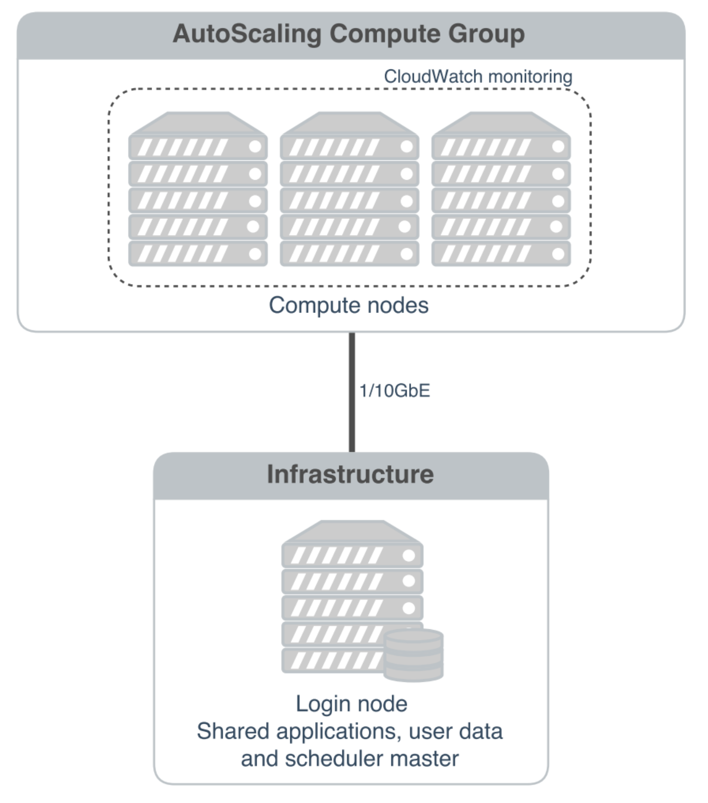

.. _basic_cluster_operation:

Basic cluster operation
=======================

Logging in
----------

You can access the login node for your private Flight Compute cluster using SSH from the network ranges you permitted at launch time. You will need to use the SSH keypair configured for the cluster in order to access it. 

In cluster launched using the Flight Compute AWS Marketplace Cloud-formation template, compute nodes do not have Internet-addressable IP addresses. In order to access individual compute nodes, you must first login to the cluster login node. 

When you login to the cluster via SSH, you are automatically placed in your home-directory. This area is shared across all compute nodes in the cluster, and is mounted in the same place on every compute. Data copied to the cluster or created in your home-directory on the login node is also accessible from all compute nodes. 

Becoming the root user
----------------------

Most cluster operations, including starting applications and running jobs, should be performed as the user created when the Flight Compute cluster was launched from AWS Marketplace. However - for some privileged operations, users may need to change to being the root user. Users can prefix any command they want to run as the root user with the ``sudo`` command; e.g. 

   ``sudo yum install screen``
   
For security reasons, SSH login as the root user is not permitted to a Flight Compute environment. To get a Linux shell with root privileges, please login as your standard user then execute the command ``sudo -s``. 

Users must exercise caution when running commands as root, as they have the potential to disrupt cluster operations. 

Finding the names of your compute nodes
---------------------------------------

An Alces Flight Compute cluster may contain any number of compute nodes which may be automatically started and stopped in response to the workloads being processed. The hostnames of compute nodes are set automatically at launch time - your set of compute nodes may change during the life span of your cluster login node. Flight Compute automatically updates a list of compute node names in response to the changing size of your cluster, and uses them to populate a *genders* group called **nodes**. 

Users can find the names of their compute nodes by using the ``nodeattr`` command; e.g.

  - ``nodeattr -s nodes`` - shows a space-separated list of current compute node hostnames
  - ``nodeattr -c nodes`` - shows a comma-separated list of current compute node hostnames
  - ``nodeattr -n nodes`` - shows a new-line-separated list of current compute node hostnames

The login node hostname for Flight Compute clusters launched from AWS Marketplace is always ``login1``. 

Moving between login and compute nodes
--------------------------------------

Flight Compute clusters automatically configure a trust relationship between login and compute nodes in the same cluster to allow users to login between nodes via SSH without a password. This configuration allows moving quickly and easily between nodes, and simplifies running large-scale jobs that involve multiple nodes. From the command line, a user can simply use the **ssh <node-name>** command to login to one of the compute nodes from the login node. For example, to login to a compute node named ``host-22-33-11-123`` from the login node, use the command:

  ``ssh host-22-33-11-123``
  
Use the ``logout`` command (or press **CTRL+D**) to exit the compute node and return to the login node.

Using PDSH
----------

Users can run a command across all compute nodes at once using the ``pdsh`` command. This can be useful if users want to make a change to all nodes in the cluster - for example, installing a new software package. The ``pdsh`` command can take a number of parameters that control now commands are processed; for example:

  - ``pdsh -g cluster uptime`` 
     - executes the ``uptime`` command on all available compute and login nodes in the cluster
  - ``pdsh -g nodes 'sudo yum -y install screen'`` 
     - use ``yum`` to install the ``screen`` package as the root user on all compute nodes
  - ``pdsh -g nodes -f 1 df -h /tmp`` 
     - executes the command ``df -h /tmp`` on all compute nodes of the cluster, one at a time (fanout=1)
  - ``pdsh -w ip-10-75-0-235,ip-10-75-0-66 which ldconfig`` 
     - runs the ``which ldconfig`` command on two named nodes only
  

  

