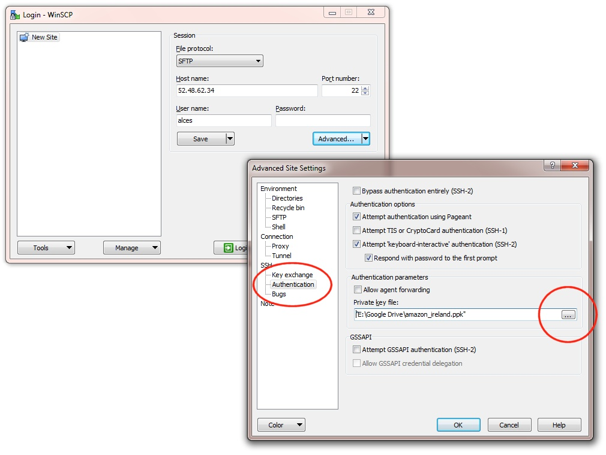
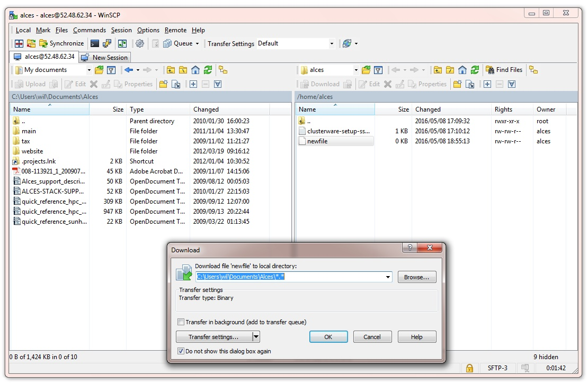

.. _data_basics:

Working with data and files
###########################

Organising data on your cluster
===============================

Shared filesystem
----------------- 

Your Flight Compute cluster includes a shared home filesystem which is mounted across the login and all compute nodes. Files copied to this area are available via the same absolute path on all cluster nodes. The size of this area is controlled by the setting used when you created your cluster. The shared filesystem is typically used for job-scripts, input and output data for the jobs you run.

Users must make sure that they copy data they want to keep off the shared filesystem before the Flight Compute cluster is terminated. This documentation provides example methods for copying data back to your local client system, or storing it in the **AWS Simple Storage Service (S3)**. 

Your home directory
-------------------

The shared filesystem includes the home-directory area for the user you created when your cluster was launched. Linux automatically places users in their home-directory when they login to a node. By default, Flight Compute will create your home-directory under the ``/home/`` directory, named after your username. For example, if your user is called **jane**, then your home-directory will have the absolute path ``/home/jane/``.

The Linux command line will accept the ``~`` (*tilde*) symbol as a substitute for the currently logged-in users' home-directory. The environment variable ``$HOME`` is also set to this value by default. Hence, the following three commands are all equivalent when logged in as the user **jane**:

 - ``ls /home/jane``
 - ``ls ~``
 - ``ls $HOME``
 

The **root** user in Linux has special meaning as a privileged user, and does not have a shared home-directory across the cluster. The **root** account on all nodes has a home-directory in ``/root``, which is separate for every node. For security reasons, users are not permitted to login to a node as the root user directly - please login as a standard user and use the ``sudo`` command to get privileged access. 

 
Local scratch storage
--------------------- 

Your compute nodes have an amount of disk space available to store temporary data under the ``/tmp`` mount-point. The size of this area will depend on the type and size of instance you selected at the time your cluster was launched. This area is intended for temporary data created during compute jobs, and shouldn't be used for long-term data storage. Compute nodes are configured to clear up temporary space automatically, removing orphan data left behind by jobs. In addition, an auto-scaling cluster may automatically terminate idle nodes, resulting in the loss of any files stored in local scratch space. 

Users must make sure that they copy data they want to keep back to the shared filesystem after compute jobs have been completed. 

Copying data between nodes
--------------------------

Flight Compute cluster login and compute nodes all mount the shared filesystem, so it is not normally necessary to copy data directly between nodes in the cluster. Users simply need to place the data to be shared in their home-directory on the login node, and it will be available on all compute nodes in the same location. 

If necessary, users can use the ``scp`` command to copy files from the compute nodes to the login node; for example:

 - ``scp ip-10-75-0-235:/tmp/myfile.txt .``
 
Alternatively, users could login to the compute node (e.g. ``ssh ip-10-75-0-235``) and copy the data back to the shared filesystem on the node:

.. code:: bash
    
    ssh ip-10-75-0-235 
    cp /tmp/myfile ~/myfile

Copying data files to the cluster
=================================

Many compute workloads involve processing data on the cluster - users often need to copy data files to the cluster for processing, and retrieve processed data and results afterwards. This documentation describes a number of methods of working with data on your cluster, depending on how users prefer to transfer it.

Using command-line tools to copy data
-------------------------------------

The cluster login node is accessible via SSH, allowing use of the ``scp`` and ``sftp`` commands to transfer data from your local client machine.

**Linux/Mac**

Linux and Mac users can use in-built SSH support to copy files. To copy file **mydata.zip** to your cluster on IP address 52.48.62.34, use the command:

  ``scp -i mykeyfile.pem mydata.zip jane@52.48.62.34:.``
    
- replace ``mykeyfile.pem`` with the name of your SSH public key
- replace ``jane`` with your username on the cluster

**Windows**

Windows users can download and install the `pscp <http://www.chiark.greenend.org.uk/~sgtatham/putty/download.html>`_ command to perform the same operation (for this you will need your .pem key in .ppk format, see :ref:`connecting from Windows with Putty<windows-putty-access>`):

  ``pscp -i mykeyfile.ppk mydata.zip jane@52.48.62.34:/home/jane/.``
    
**SCP/PSCP**

Both the ``scp`` and the ``pscp`` commands take the parameter ``-r`` to recursively copy entire directories of files to the cluster. 

To retrieve files from the cluster, simply specify the location of the remote file first in the ``scp`` command, followed by the location on the local system to put the file; e.g.

To copy file **myresults.zip** from your cluster on IP address 52.48.62.34 to your local Linux or Mac client:

  ``scp -i mykeyfile.pem jane@52.48.62.34:/home/jane/myresults.zip .``

Using a graphical client to copy data
-------------------------------------

There are also a number of graphical file-management interfaces available that support the SSH/SCP/SFTP protocols. A graphical interface can make it easier for new users to manage their data, as they provide a simple drag-and-drop interface that helps to visualise where data is being stored. The example below shows how to configure the `WinSCP <https://winscp.net/eng/download.php>`_ utility on a Windows client to allow data to be moved to and from a cluster.

- On a Windows client, download and install `WinSCP <https://winscp.net/eng/download.php>`_
- Start WinSCP; in the **login** configuration box, enter the IP address of your Flight Compute cluster login node in the ``Host name`` box
- Enter the username you configured for your cluster in the ``User name`` box
- Click on the ``Advanced`` box and navigate to the ``SSH`` sub-menu, and the ``Authentication`` item
- In the ``Private key file`` box, select your AWS private key, and click the ``OK`` box.

- Optionally click the ``Save`` button and give this session a name
- Click the ``Login`` button to connect to your cluster
- Accept the warning about adding a new server key to your cache; this message is displayed only once when you first connect to a new cluster
- WinSCP will login to your cluster; the window shows your local client machine on the left, and the cluster on the right
- To copy files to the cluster from your client, click and drag them from the left-hand window and drop them on the right-hand window
- To copy files from the cluster to your client, click and drag them from the right-hand window and drop them on the left-hand window

The amount of time taken to copy data to and from your cluster will depend on a number of factors, including:

 - The size of the data being copied
 - The speed of your Internet link to the cluster; if you are copying large amounts of data, try to connect using a wired connection rather than wireless
 - The type and location of your cluster login node instance
 

Object storage for archiving data
---------------------------------

As an alternative to copying data back to your client machine, users may prefer to upload their data to a cloud-based object storage service instead. Flight Compute clusters include tools for accessing data stored in the `AWS S3 <https://aws.amazon.com/s3/>`_ object storage service, as well as the `Dropbox <https://www.dropbox.com/>`_ cloud storage service and `SWIFT <https://wiki.openstack.org/wiki/Swift>`_ compatible services. Benefits of using an object-based storage service include:

 - Data is kept safe and does not have to be independently backed-up
 - Storage is easily scalable, with the ability for data to grow to practically any size
 - You only pay for what you use; you do not need to buy expansion room in advance
 - Storage service providers often have multiple tiers available, helping to reduce the cost of storing data
 - Data storage and retrieval times may be improved, as storage service providers typically have more bandwidth than individual sites
 - Your company, institution or facility may receive some storage capacity for free which you could use
 
Object storage is particularly useful for archiving data, as it typically provides a convenient, accessible method of storing data which may need to be shared with a wide group of individuals. 

.. hint:: Storage services that are compatible with standard protocols such as ``S3`` and ``SWIFT`` should be compatible with the tools provided on an Alces Flight cluster. Configure the ``service address`` or ``Authentication Endpoint`` appropriately for your chosen storage provider in order to use third-party services. 

Using alces storage commands
----------------------------

Your Flight Compute cluster includes command-line tools which can be used to enable access to existing **AWS S3**, **Swift** and **Dropbox** accounts. Object storage services which are compatible with S3 or Swift can also be configured. For example - a Ceph storage platform with a compatible **RADOS-gateway** can be accessed using S3 support. To enable access to these services, users must first enable them with the following commands:

 - ``alces storage enable s3`` - enables **AWS S3** service
 - ``alces storage enable swift`` - enables **Swift** service
 - ``alces storage enable dropbox`` - enables **Dropbox** service

.. note:: The enabled & available storage types can be viewed with ``alces storage show`` & ``alces storage avail`` respectively.
 
Once enabled, a user can configure one or more storage services for use on the command-line, giving each one a friendly name to identify it. The syntax of the command is shown below:

  ``alces storage configure <friendly-name> <type-of-storage>``

For example; to configure access to an AWS S3 account using the access and secret key, the following commands can be used:

.. code:: bash

    [alces@login1(scooby) ~]$ alces storage configure my-s3area1 s3
    Display name [my-s3area1]:
    Access key: PZHAA6I2OEDF9F2RQS8Q
    Secret key: ********************
    Service address [s3.amazonaws.com]:
    alces storage configure: storage configuration complete

.. note:: If using a Ceph filesystem with a RADOS-gateway, enter the hostname of your gateway service as the ``Service address`` configuration item. For Amazon S3 based storage, choose the default service address.

To configure access to a Swift compatible storage service, enter your username, API key and endpoint URL for the service. Please contact your storage service administrator to obtain these values; e.g.

.. code:: bash

    [alces@login1(scooby) ~]$ alces storage configure my-swift swift
    Display name [my-swift]:
    Username: SLOS9275161
    API key: ********************
    Authentication endpoint: https://lon02.objectstorage.softlayer.net/auth/v1.0/
    alces storage configure: storage configuration complete

When configuring a Dropbox account, the user is provided with a URL that must be copied and pasted into a browser session on their local client machine:

.. code:: bash

    [alces@login1(scooby) ~]$ alces storage configure mydb dropbox
    Display name [mydb]:
    Please visit the following URL in your browser and click 'Authorize':
    
      https://www.dropbox.com/1/oauth/authorize?oauth_token=bdD4e2V2rjTf752u
    
    Once you have completed authorization, please press ENTER to continue...

Copy the URL provided into your browser on your client system - you will be prompted to login to Dropbox (if you don't already have a session); click on the *Authorize* button on the next screen to allow your Flight Compute cluster to access the files stored in your Dropbox account.

Once you have set up one or more configurations, you can switch between the different storage spaces using the following commands:

.. code:: bash

    [alces@login1(scooby) ~]$ alces storage use my-s3area1
    alces storage use: storage configuration 'my-s3area1' now set as default
    
From the command-line, users can upload and download data from their configured storage areas. To upload data to an object storage area, use the ``alces storage put <local-file> <object-name>`` command; e.g.

.. code:: bash

    [alces@login1(scooby) ~]$ alces storage put mydatafile datafile-may2016
    alces storage put: mydatafile -> datafile-may2016
    
    [alces@login1(scooby) ~]$ alces storage ls
    2012-08-23 17:08        DIR   Public
    2016-05-14 16:10       1335   datafile-may2016
    2012-08-23 17:08     246000   Getting Started.pdf
    
    [alces@login1(scooby) ~]$

To download data from an object storage service, use the ``alces storage get <object-name> <local-file>`` command; e.g.

.. code:: bash

    [alces@login1(scooby) ~]$ alces storage get "Getting Started.pdf" instructions.pdf
    alces storage get: Getting Started.pdf -> /home/alces/instructions.pdf

    [alces@login1(scooby) ~]$ file instructions.pdf
    instructions.pdf: PDF document, version 1.4

    [alces@login1(scooby) ~]$

Users can also create new buckets in their object-storage service using the ``alces storage mb <bucket-name>`` command, and then put objects into the new bucket; e.g.

.. code:: bash

    [alces@login1(scooby) data]$ alces storage mb newdata
    alces storage mkbucket: created bucket newdata

    [alces@login1(scooby) data]$ alces storage put datafile2 newdata/datafile2
    alces storage put: datafile2 -> newdata/datafile2

    [alces@login1(scooby) data]$ alces storage ls newdata
    2016-05-14 16:14   20971520   datafile2

    [alces@login1(scooby) data]$

Users can also recursively transfer entire buckets (including any buckets contained within) using the ``-r`` option to the ``alces storage`` command; e.g.

.. code:: bash

    [alces@login1(scooby) ~]$ alces storage put -r datadir datadir2
    alces storage put: datadir/datafile2 -> datadir2/datafile2
    alces storage put: datadir/datafile3 -> datadir2/datafile3
    alces storage put: datadir/datafile4 -> datadir2/datafile4
    alces storage put: datadir/datafile5 -> datadir2/datafile5
    alces storage put: datadir/datafile6 -> datadir2/datafile6

    [alces@login1(scooby) ~]$

.. note:: As well as being able to recursively ``put`` entire directories from a local path into the remote storage target, users can also ``get`` and ``rm`` directories recursively, again using the ``-r`` or ``-R`` option with their ``alces storage`` command.

Saving data before terminating your cluster
-------------------------------------------

When you've finished working with your Alces Flight Compute cluster, you can select to terminate it in the console for your Cloud service. This will stop any running instances and wipe the shared storage area before returning the block storage volumes back to the provider. Before you shutdown your cluster, users must ensure that they store their data safely in a persistent service, using one of the methods described in this documentation. When you next launch a Flight Compute cluster, you can restore your data from the storage service to begin processing again. 

