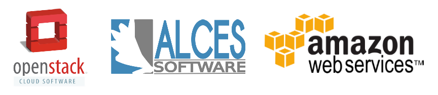

Flight Appliance Documentation
==========================================

Guides designed to create a simple research compute environment creation process using many popular public and private cloud platforms together with the Alces Flight Appliances.

Quick-start
-----------
:ref:`Deploy an SGE compute cluster using OpenStack Heat <heat-deploy-sge-cluster>`

License
-------
See `Creative-Commons: Attribution-ShareAlike 4.0 International <http://creativecommons.org/licenses/by-sa/4.0/>`_

.. Navigation/TOC

.. toctree::
   :maxdepth: 3
   :glob:
   :caption: Alces Flight Appliances
   :name: flightappliances

   about/alces-flight-compute
   about/alces-flight-storage-access
   about/alces-flight-application-manager
   about/alces-flight-galaxy

.. toctree::
   :maxdepth: 3
   :glob:
   :caption: Environment Usage: HPC 
   :name: environmentusage 

   getting-started/environment-usage/run-an-interactive-application
   getting-started/environment-usage/run-a-graphical-application

.. toctree::
   :maxdepth: 1
   :glob:
   :caption: Application Usage: HPC 
   :name: appusage 

   getting-started/environment-usage/gridware-features/*
   getting-started/environment-usage/gridware-howto/*

.. toctree::
   :maxdepth: 1
   :glob:
   :caption: Application Usage: Galaxy 
   :name: galaxyusage 

   getting-started/environment-usage/galaxy/*
