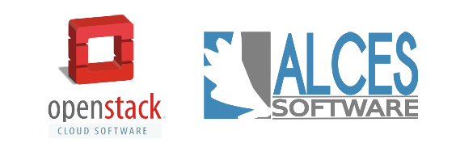

Flight Appliance Documentation - OpenStack
==========================================

Guides designed to create a simple research compute environment creation process using many popular public and private cloud platforms together with the Alces Flight Appliances.

Quick-start
-----------
:ref:`Deploy an SGE compute cluster using OpenStack Heat <heat-deploy-sge-cluster>`

License
-------
See `Creative-Commons: Attribution-ShareAlike 4.0 International <http://creativecommons.org/licenses/by-sa/4.0/>`_

.. Navigation/TOC

.. toctree::
   :maxdepth: 3
   :glob:
   :caption: About
   :name: abouttoc

   about/*

.. toctree::
   :maxdepth: 2
   :glob:
   :caption: Getting started
   :name: gstoc

   getting-started/deployment

.. toctree::
   :maxdepth: 2
   :glob:
   :caption: Using your environment 
   :name: usagetoc

   environment-usage/environment_usage

.. toctree::
   :maxdepth: 2
   :glob:
   :caption: Customizing your environment 
   :name: configurationtoc

   configuration/*
