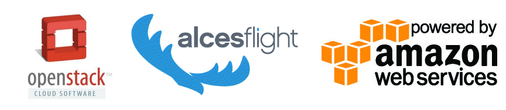

Flight Appliance Documentation - 2016.2
==========================================

This site holds documentation designed to help users create a simple research compute environment using popular public and private cloud platforms. As well as launching and accessing the environment, guides and tutorials are included to help end-users install software applications, manage their data and run different workloads. 

License
-------
This documentation is released under the `Creative-Commons: Attribution-ShareAlike 4.0 International <http://creativecommons.org/licenses/by-sa/4.0/>`_ license. The Alces Flight Compute software is released under the terms of the `Alces Flight EULA <https://s3-eu-west-1.amazonaws.com/flight-aws-marketplace/2016.1/EULA.txt>`_. Please read the relevant license text before proceeding to use. 

Prerequisites
---------------
We recommend that users wishing to use Flight Appliances have basic Linux skills. The ability to move about in a filesystem, copy and delete files, read and edit files on the command-line will be needed in order to get the best out of the Flight software. 

.. Navigation/TOC

.. toctree::
   :maxdepth: 3
   :glob:
   :caption: Overview of Flight Compute
   :name: overview

   overview/*
   
.. toctree::
   :maxdepth: 3
   :glob:
   :caption: Launching your cluster on AWS
   :name: launch-aws

   launch-aws/*   
   
.. toctree::
   :maxdepth: 3
   :glob:
   :caption: Launching your cluster on OpenStack
   :name: launch-os
   
   launch-os/*
   
.. toctree::
   :maxdepth: 3
   :glob:
   :caption: Basic cluster operation
   :name: basics
   
   basics/*
   
.. toctree::
   :maxdepth: 3
   :glob:
   :caption: Getting data to and from your cluster
   :name: databasics
   
   databasics/*
   
.. toctree::
   :maxdepth: 3
   :glob:
   :caption: Graphical access to your cluster
   :name: graphicaldesktop
   
   graphical-desktop/*
   
.. toctree::
   :maxdepth: 3
   :glob:
   :caption: Software applications on your cluster
   :name: apps
   
   apps/*
   
.. toctree::
   :maxdepth: 3
   :glob:
   :caption: Parallel (MPI) applications
   :name: mpiapps
   
   mpiapps/*
   
.. toctree::
   :maxdepth: 3
   :glob:
   :caption: Cluster job-scheduler
   :name: jobschedulers
   
   jobschedulers/*
   
.. toctree::
   :maxdepth: 3
   :glob:
   :caption: Open Grid-scheduler (SGE)
   :name: sge
   
   sge/*
   
   
Overview:
 - What is Alces Flight (what does it do, and what it doesn't do)
 - Who is it for
 - Pre-reqs
 - How much does it cost
 - Where can I get help

Launching your cluster on AWS
 - Prerequisites
 - Finding Alces Flight Compute on AWS
 - How to answer CFT questions
 - on-demand vs SPOT and autoscaling
 - Accessing your cluster
 - What happens when you terminate the cluster

Launching your cluster on OpenStack
 - Prerequisites
 - Preparing images for launch
 - How to answer Heat questions
 - Accessing your cluster
 - What happens when you terminate the cluster

Basic cluster operation:
 - Logging in; how to, who can, etc.
 - Becoming the root user
 - Moving between login and compute nodes
 - Using PDSH

Getting data to and from your cluster:
 - Shared filesystem (size of it, why it's there)
 - Copying data between nodes
 - Using SCP/SFTP to copy files to/from the cluster (+winscp client and others)
 - Object storage (S3/dropbox)
 - Using alces storage commands
 - Important of storing files safely before shutting down the cluster

Graphical desktop access to your login node:
 - Launching a gnome desktop session
 - Connecting to the session from an external client
 - Connecting multiple users to the same session
 - Resizing the desktop to fit your screen
 - Using alces session commands to enable other types of session
 - Terminating and viewing running sessions

Software applications:
 - base OS version and default software (e.g. gcc)
 - modules environment management; usage and commands, dependencies
 - importance of "module display" to show licenses
 - installing new applications using alces gridware command
 - enabling volatile repos and manual dependency resolution
 - installing from depots
 - installing commercial apps and license management

Parallel (MPI) applications:
 - What the MPI is for
 - How to install MPIs for applications
 - Running an MPI job manually

Job schedulers:
 - What they are for
 - grid-engine specifics:
  - interactive and non-interactive/batch jobs 
  - what are job scripts with simple example (link to page on alces template command)
  - default resources
  - viewing queue and host status
  - deleting jobs from the queue
  - giving job-scheduler instructions (on command-line and in job-scripts)
  - simple directive examples
  - Requesting more resources 
    - More CPU cores
    - More memory (including using qacct to find out how much has been used)
    - Longer runtime (including why you'd want to specify this)
  - Documentation of all available scheduler directives
 - alces template command for generating jobscripts

.. toctree::
   :maxdepth: 3
   :glob:
   :caption: Example workflows 
   :name: exampleworkflows

   getting-started/environment-usage/run-an-interactive-application
   getting-started/environment-usage/run-a-graphical-application
   getting-started/environment-usage/gridware-features/*
   getting-started/environment-usage/gridware-howto/*
   getting-started/environment-usage/run-an-mpi-job
   getting-started/environment-usage/galaxy/*
   clusterware-storage/alces-storage-overview
   clusterware-storage/alces-storage-file-config
   clusterware-storage/alces-storage-file-usage
   clusterware-storage/alces-storage-object-config
   clusterware-storage/alces-storage-object-usage
   environment-usage/alces-storage-examples

.. toctree::
   :maxdepth: 3
   :glob:
   :caption: Alces Flight Roadmap and future Appliances
   :name: flightappliances

   about/alces-flight-compute
   about/alces-flight-storage-access
   about/alces-flight-application-manager
   about/alces-flight-galaxy-appliance
