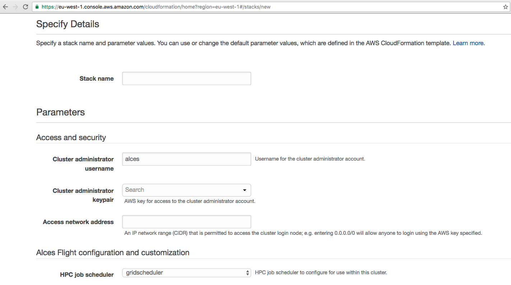

.. _launching_on_aws:

Launching on AWS
================

Alces Flight Compute can be launched on the Amazon Web Services (AWS) public cloud platform to give you instant access to your own, private HPC cluster from anywhere in the world. You can choose what resources your cluster will start with (e.g. number of nodes, amount of memory, etc.), and for how long the cluster will run. 

Prerequisites
=============

There are some things that you need to get ready before you can launch your own cluster on AWS. They are:

 - **Client prerequisites**
 - **Get yourself an AWS account**; this might be your personal account, or you may have a sub-account as part of your institution or company
 - **Create an SSH keypair** for yourself in the region you want to run in. `Follow this guide <http://docs.aws.amazon.com/AWSEC2/latest/UserGuide/ec2-key-pairs.html>`_ if you've not done this before. 

Your AWS account must have appropriate permissions to do the following:
 - Launch Cloud Formation templates
 - Create a VPC (virtual private cloud)
 - Create subnets and allocate IP addresses
 - Create an IAM permission
 
More details on `AWS Identity and Access Management (IAM) are available here <https://aws.amazon.com/iam/>`_.

Creating your Cluster
=====================

How much will it cost?
----------------------

The Alces Flight software appliance itself it free; however, you're likely to incur costs when running a cluster on AWS resources. Charges typically fall into the following categories:

 - `EC2 <https://aws.amazon.com/ec2/>`_ charges for running instances (your login and compute nodes) 
 - `EBS <https://aws.amazon.com/ebs/>`_ charges for shared cluster filesystem capacity
 - `S3 <https://aws.amazon.com/s3/>`_ charges for storing data as objects
 - `Data-egress charges <https://aws.amazon.com/blogs/publicsector/aws-offers-data-egress-discount-to-researchers/>`_ for network traffic out of AWS
 - `Miscellaneous other charges <https://aws.amazon.com/pricing/services/>`_ (e.g. IP address allocation, DNS entry updates, etc.)

Most charges are made per unit (e.g. per compute node instance, or per GB of storage space) and per hour, often with price breaks for using more of a particular resource at once. A full breakdown of pricing is beyond the scope of this document, but there are several tools designed to help you estimate the expected charges:

 - `AWS Simple Monthly Calculator <https://calculator.s3.amazonaws.com/index.html>`_
 - `AWS TCO Calculator <https://awstcocalculator.com/>`_

Finding Alces Flight Compute on AWS
-----------------------------------

Sign-in to your AWS account, and navigate to the `AWS Marketplace <https://aws.amazon.com/marketplace>`_. Search for **Alces Flight** in the search box provided to find the Flight Compute product. Click on the *Continue* button to view details on how to launch. 

As well as an Amazon Machine Image (AMI), Flight Compute subscribers are provided with a Cloud-Formation template (CFT) that can be used to launch your own cluster rapidly after answering a few setup questions. Advanced users can also use the AMI directly with their own CFTs to provide more customised environments for specialised requirements. This documentation is designed to assist new users when launching with the CFT provided on the AWS Marketplace page. 

How to answer Cloud-Formation questions
---------------------------------------

When you choose to start a Flight Compute cluster from AWS Marketplace, you will be prompted to answer a number of questions about what you want the environment to look like. Flight will automatically launch your desired configuration based on the answers you give. The questions you'll be asked are the following:

 - **Stack name**; this is the name that you want to call your cluster. It's fine to enter **"cluster"** here if this is your first time, but entering something descriptive will help you keep track of multiple clusters if you launch more. Naming your cluster after colours (red, blue, orange), your favourite singer (clapton, toriamos, bieber) or Greek legends (apollo, thor, aphrodite) keep things more interesting. Avoid using spaces and punctuation, or names longer than 16 characters.
 
 - **ComputeSpotPrice**; in this box, enter the maximum amount you agree to pay per compute node instance, in US dollars. Entering 0 (zero) in this box will cause Flight to use on-demand instances for compute nodes. See the section below on *On-demand and SPOT* instances for more details.
 
 - **ComputeType**; use the drop-down box to choose what type of compute nodes you want to launch. All compute nodes will launch as the same type. Different types of nodes cost different amounts to run - see the `AWS Pricing Guide <https://aws.amazon.com/ec2/pricing/>`_ for more information.
 
 - **InitialNodes**; enter the number of nodes you want to start immediately in this box. Entering any number here will enable auto-scaling of the cluster - Flight Compute will add more nodes when jobs are queued, and shutdown idle nodes when they have no jobs to process. Entering 0 (zero) in this box will disable auto-scaling, and start all cluster nodes immediately. 
 
 - **Keypair**; choose an existing AWS keypair to launch your Flight cluster with. If there are no keypairs in the list, check that you've already generated a keypair in the region you're launching in. You must have the private key available for the chosen keypair in order to login to your cluster.
 
 - **LoginSystemDiskSize**; choose the size of your login node disk, which acts as the shared filesystem for your cluster. Requesting a larger size will give you more space for your data, but will cost more to run.
 
 - **LoginType**; use the drop-down box to choose the AWS instance type for your login node. Larger sizes will perform better, while smaller sizes will be less expensive to run. Your login node is always created as an on-demand instance. 
 
 - **MaxNodes**; enter the maximum size that your cluster will scale to, up to a maximum of 32 nodes. 
 
 - **NetworkCIDR**; enter a network range that is permitted to access your cluster. This will usually be the IP address of your system on the Internet; ask your system administrator for this value, or `use a web search <https://www.google.com/search?q=whats+my+ip+address&ie=utf-8&oe=utf-8&gws_rd=cr&ei=tVIvV5_dKsHagAath7OYCw>`_ to find out. If you want to be able to access your cluster from anywhere on the Internet, enter "0.0.0.0/0" in this box. 
 
 - **Username**; enter the username you want to use to connect to the cluster. Flight will automatic create this user on the cluster, and add your public SSH key to the user. 
 

   
When all the questions are answered, click the **Next** button to proceed. Enter any tags you wish to use to identify instances in your environment on the next page, then click the **Next** button again. On the review page, read through the answers you've provided and correct any mistakes - click on the *Capabilities* check-box to authorize creations of an IAM role to report cluster performance back to AWS, and click on the **Create** button.

Your personal compute cluster will then be created. While on-demand instances typically start within in few minutes, SPOT based instances may take longer to start, or may be queued if the SPOT price you entered is less than the current price. 

On-demand vs SPOT instances
---------------------------

The AWS EC2 service supports a number of different charging models for launching instances. The quick-start Cloud-formation template included with Alces Flight Compute in AWS Marketplace allows users to choose between two different models:

 - On-demand instances; instances are launched immediately at a fixed hourly price. Once launched, your instance will not normally be terminated unless you choose to stop it.
 
 - **`SPOT instances <https://aws.amazon.com/ec2/spot/>`_**; instances are requested with a bid-price entered by the end-user which represents the maximum amount they want to pay for them per hour. If public demand for this instance type allows, instances will be launched at the current SPOT price, which is typically much lower than the equivalent on-demand price. As demand increases for the instance type increases, so the cost per hour charged to users also increases. AWS will automatically stop any instances (or delay starting new ones) if the current SPOT price is higher than the maximum amount users want to pay for them. 
 
SPOT instances are a good way to pay a lower cost for cloud computing for non-urgent workloads. If SPOT compute node instances are terminated in your cluster, any running jobs will be lost - the nodes will also be automatically removed from the queue system to ensure no new jobs attempt to start on them. Once the SPOT price becomes low enough for your instances to start again, your compute nodes will automatically restart and rejoin the cluster. 

The Cloud-formation templates provided for Alces Flight Compute via AWS Marketplace will not launch a login node instance on the SPOT market - login nodes are always launched as on-demand instances, and are immune fluctuating costs in the SPOT market.
 

Using an auto-scaling cluster
-----------------------------

An auto-scaling cluster automatically reports the status of the job scheduler queue to AWS to allow idle compute nodes to be shut-down, and new nodes to be started when jobs are queuing. Auto-scaling is a good way to manage the size of your ephemeral cluster automatically, and is useful if you want to run a number of unattended jobs, and minimise costs after the jobs have finished by terminating unused resources.

If you are running jobs manually (i.e. not through the job-scheduler), you may wish to disable autoscaling to prevent nodes not running scheduled jobs from being shutdown. This can be done by entering 0 (zero) in the **ComputeSpotPrice** when launching your Flight Compute cluster via AWS Marketplace, or using the command ``alces configure autoscaling disable`` command when logged in to the cluster login node.

Accessing your cluster
======================

Once your cluster has been launched, the login node will be accessible via SSH from the IP address range you entered in the **NetworkCIDR**. If you entered "0.0.0.0/0" as the **NetworkCIDR**, your login node will be accessible from any IP address on the Internet. The login node's public IP address is reported by the AWS Cloud-formation template, along with the username you must use to login with your keypair. 

To access the cluster login node from a Linux or Mac client, use the following command:

 - ``ssh -i mypublickey.pub myusername@52.50.141.144``
 
 Where:
  - ``mypublickey.pub`` is the name of your public SSH key you selected when launching the cluster
  - ``myusername`` is the username you entered when launching the cluster
  - ``52.50.141.144`` is the Access-IP address reported by the AWS console after your cluster has been launched
  
  
If you are accessing from a Windows client using the Putty utility, enter the username and IP address of the cluster login node in the "Host Name" box provided:

Terminating the cluster
=======================

Your cluster login node will continue running until you terminate it via the `AWS web console <https://aws.amazon.com/console/>`_. If you are running an auto-scaling cluster, compute nodes will automatically be added and taken away up to the limits you specified depending on the number of jobs running and queued in the job-scheduler. When you have finished running your workloads, navigate to the `Cloud-formation console <https://console.aws.amazon.com/cloudformation/>`_, select the name of your cluster from the list of running stacks, and click **Delete stack** from the actions menu.

Over the next few minutes, your cluster login and compute nodes will be terminated. Any data held on EBS will be erased, with storage volumes being wiped and returned to the AWS pool. **Ensure that you have downloaded data that you want to keep to your client machine, or stored in safely in an object storage service before terminating your cluster.**

See `Getting data to and from your cluster </databasics/data_basics>` for more information on storing your data. 