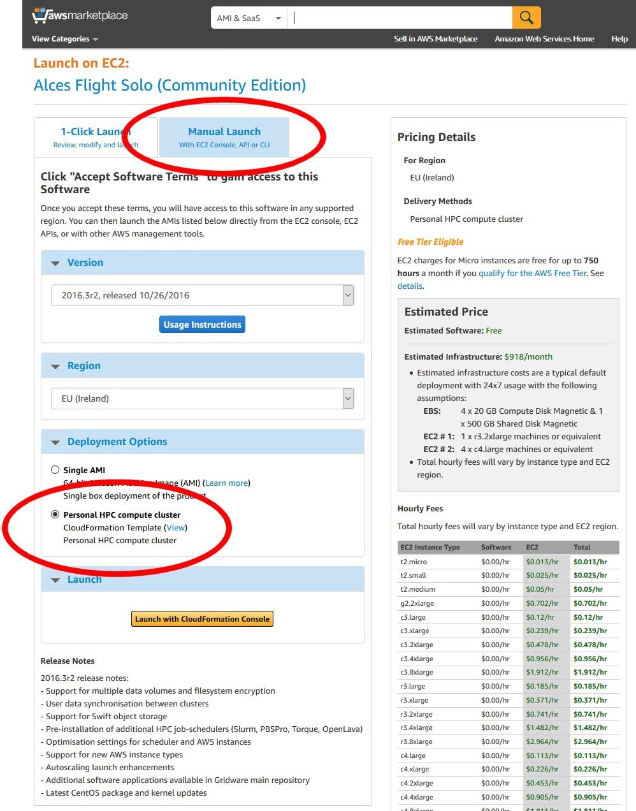
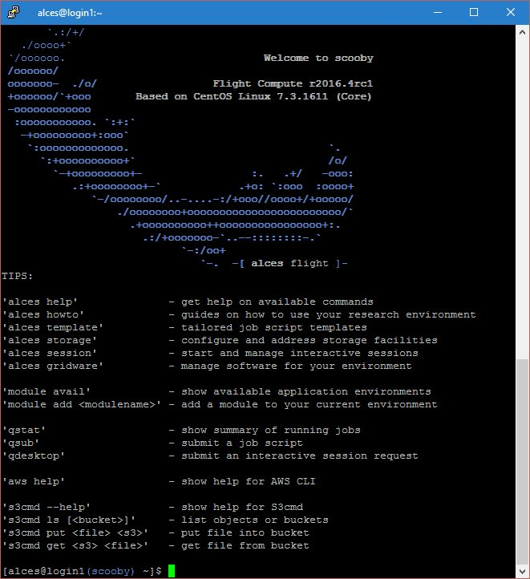
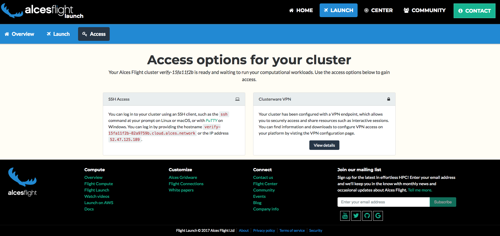

.. _launching_on_aws:

Launching on AWS
################

Alces Flight Compute Solo can be launched on the Amazon Web Services (AWS) public cloud platform to give you instant access to your own, private HPC cluster from anywhere in the world. You can choose what resources your cluster will start with (e.g. number of nodes, amount of memory, etc.), and for how long the cluster will run. 

Prerequisites
=============

There are some things that you need to get ready before you can launch your own cluster on AWS. They are:

 - **Check client prerequisites** to make sure you have the software you need - see :ref:`whatisit` 
 - **Get yourself an AWS account**; this might be your personal account, or you may have a sub-account as part of your institution or company
 - **Create an SSH keypair** for yourself in the region you want to run in. `Follow this guide <http://docs.aws.amazon.com/AWSEC2/latest/UserGuide/ec2-key-pairs.html>`_ if you've not done this before. 

Your AWS account must have appropriate permissions to do the following:
 - Launch instances from a CloudFormation templates
 - Create a VPC (virtual private cloud)
 - Create subnets and allocate IP addresses
 - Create an IAM permission
 
More details on `AWS Identity and Access Management (IAM) are available here <https://aws.amazon.com/iam/>`_.

Creating your Cluster
=====================

Method of Launching
-------------------

The simplest method of launching a cluster is by using the AWS Marketplace - clusters launch using an AWS CloudFormation template which asks the user a number of simple questions in order to configure their cluster environment. This method is documented on this page, and is the fastest way to launch your own, personal HPC cluster environment. 

Advanced users may also wish to launch a cluster one instance at a time, or deploy a single login node to be used interactively. Follow this guide for information on how to manually configure a cluster by launching individual instances - :ref:`manual_launch`.

.. note:: If you wish to use CloudFormation to create a single Alces Flight instance on AWS (e.g. just a login node) instead of using :ref:`the AMI method <manual_launch>`, set **Autoscaling policy** to ``enabled`` and **Initial compute nodes (autoscaling)** to ``0``.

Users can also use one of the example CloudFormation templates as the basis of their own cluster deployments. This allows more customisation of your cluster, including choosing how many nodes can be launched, configuring different types of EBS backing storage and choosing different availability zones for your compute nodes. For more information, see - :ref:`template_launch`.

How much will it cost?
----------------------

The cost for running your cluster will depend on a number of different factors including the resources you consume and the software you subscribe to. Charges typically fall into the following categories:

 - `EC2 <https://aws.amazon.com/ec2/>`_ charges for running instances (your login and compute nodes) 
 - `EBS <https://aws.amazon.com/ebs/>`_ charges for shared cluster filesystem capacity
 - `S3 <https://aws.amazon.com/s3/>`_ charges for storing data as objects
 - `Data-egress charges <https://aws.amazon.com/blogs/publicsector/aws-offers-data-egress-discount-to-researchers/>`_ for network traffic out of AWS
 - `Miscellaneous other charges <https://aws.amazon.com/pricing/services/>`_ (e.g. IP address allocation, DNS entry updates, etc.)
 - Any costs for running the version of Alces Flight that you subscribe to

Most charges are made per unit (e.g. per compute node instance, or per GB of storage space) and per hour, often with price breaks for using more of a particular resource at once. A full breakdown of pricing is beyond the scope of this document, but there are several tools designed to help you estimate the expected charges; e.g.

 - `AWS Simple Monthly Calculator <https://calculator.s3.amazonaws.com/index.html>`_
 - `AWS TCO Calculator <https://awstcocalculator.com/>`_

Finding Alces Flight Compute on AWS
-----------------------------------

Sign-in to your AWS account, and navigate to the `AWS Marketplace <https://aws.amazon.com/marketplace>`_. Search for **Alces Flight** in the search box provided to find the Flight Compute product. 

Click on the **Continue** button to view details on how to launch. 

Launching a Personal HPC cluster from AWS Marketplace
-----------------------------------------------------

Follow these instructions to launch your cluster:

 - After clicking the **Continue** button from the main product page, select the **Manual Launch** tab in your browser. 
 - Scroll down the page and select your local AWS region in the **Select a Region** section
 - Choose **Personal HPC compute cluster** from the *Deployment Options* section
 - Under the *Launch* section, click on the **Launch with CloudFormation Console** button to start deploying your cluster. 

As well as an Amazon Machine Image (AMI), Flight Compute subscribers are provided with a CloudFormation template (CFN template) that can be used to launch your own cluster rapidly after answering a few setup questions. Advanced users can also use the AMI directly with their own CFN templates to provide more customised environments for specialised requirements. This documentation is designed to assist new users when launching with the CFN template provided on the AWS Marketplace page. 

How to answer CloudFormation questions
---------------------------------------

When you choose to start a Flight Compute cluster from AWS Marketplace, you will be prompted to answer a number of questions about what you want the environment to look like. Flight will automatically launch your desired configuration based on the answers you give. The questions you'll be asked are the following:

 - **Stack name**; this is the name that you want to call your cluster. It's fine to enter **"cluster"** here if this is your first time, but entering something descriptive will help you keep track of multiple clusters if you launch more. Naming your cluster after colours (red, blue, orange), your favourite singer (clapton, toriamos, bieber) or Greek legends (apollo, thor, aphrodite) keeps things more interesting. Avoid using spaces and punctuation, or names longer than 16 characters.
 
**Access and security**

  - **Cluster administrator username**; enter the username you want to use to connect to the cluster. Flight will automatically create this user on the cluster, and add your public SSH key to the user.
  - **Cluster administrator keypair**; choose an existing AWS keypair to launch your Flight cluster with. If there are no keypairs in the list, check that you've already generated a keypair in the region you're launching in. You must have the private key available for the chosen keypair in order to login to your cluster.
  - **Access network address**; enter a network range that is permitted to access your cluster. This will usually be the IP address of your system on the Internet; ask your system administrator for this value, or `use a web search <https://www.google.com/search?q=whats+my+ip+address&ie=utf-8&oe=utf-8&gws_rd=cr&ei=tVIvV5_dKsHagAath7OYCw>`_ to find out. If you want to be able to access your cluster from anywhere on the Internet, enter "0.0.0.0/0" in this box.

**Alces Flight configuration and customization**
  - **HPC job scheduler** (`Professional Only`) ; select from a range of popular batch job schedulers to install and configure for use with your Alces Flight Compute environment
  - **Preload software** (`Professional Only`) ; select an `Alces Gridware Depot <https://github.com/alces-software/gridware-depots>`_  to install - Alces Gridware Depots are groups of packages, libraries and compilers commonly used by different disciplines
  - **Additional features to enable**; optionally select from available `Alces Flight features <https://github.com/alces-software/flight-profiles/tree/master/features>`_ including job schedulers and other useful customisations
  - **S3 bucket for customization profiles**; enter the names of :ref:`customisation profiles <customisation>` to use, separated by spaces. Leave this option blank if you have no existing customisation data, or you are starting a standard cluster.
  - **Customization profiles to enable**; enter the names of the customisation profiles to use, separated by spaces. Leave this option blank if you have no existing customisation data, or you are starting a new cluster. 

**Login node**
  - **Login node instance type**; use the drop-down box to choose the AWS instance type for your login node. Larger sizes will perform better, while smaller sizes will be less expensive to run. Your login node is always created as an on-demand instance.
  - **Specific login node instance type**; if you did not choose a login instance type from the available instance types and chose ``other`` - you may select from a list of all of the currently available AWS instance types

**Compute estate**
  - **Compute instance type**; use the drop-down box to choose what type of compute nodes you want to launch. All compute nodes will launch as the same type. Different types of nodes cost different amounts to run, and have different amounts of CPU-cores and memory - see the :ref:`available instance types <instance-types>` for more information. Node instances are grouped in the following ways:

    - **Type** (compute/balanced/memory/gpu):
      - Compute instances have 2GB of memory per core, and provide the fastest CPUs
      - Balanced instances have 4GB of memory per core, and are good all-round performers
      - Memory instances have 8GB of memory per core, and are useful for high-memory jobs
      - GPU instances have Nvidia CUDA GPU devices installed

    - **Size** (small/medium/large/dedicated):
      - Small, medium and large instances have 2, 4 or 8 CPU cores and a fraction of a 10Gb Ethernet network link
      - Dedicated instances have access to a dedicated 10Gb Ethernet network link
  - **Specific compute instance type**; if you did not choose a compute instance type from the available instance types above, and chose ``other`` - you may select from a list of all of the currently available AWS instance types
  - **Spot price**; in this box; enter the maximum amount you agree to pay per compute node instance, in US dollars. Entering **0** (zero) in this box will cause Flight to use **on-demand** instances for compute nodes. See the section below on *On-demand and SPOT* instances for more details.
  - **Autoscaling policy**; select from either ``enabled`` or ``disabled`` in this box to enable or disable auto-scaling of your cluster compute nodes
  - **Initial compute nodes (autoscaling)**; enter the number of compute nodes you want to start immediately when you have enabled the autoscaling feature. Flight Compute will add more nodes when jobs are queued, and shutdown idle nodes when they have no jobs to process. This parameter is ignored if autoscaling is disabled
  - **Initial/maximum compute nodes**; enter the maximum number of compute nodes you wish to make available to your Flight Compute cluster when autoscaling is enabled - the autoscaling feature will never create more than the maximum number specified. If the autoscaling feature is disabled, enter the total number of compute nodes you wish to create at launch time
  
**Disks and storage**
  - **Data volume layout** (`Professional Only`) ; select from a range of data volume layouts - the data volume layouts available are as follows; 

``standard``
  Configures the home directory share and application directory share using the login node system disk

``discrete.home``
  Configures the home directory share on a dedicated EBS volume and application directory share using
  the login node system disk

``discrete.apps``
  Configures the home directory share using the login node system disk and the application directory share
  using a dedicated EBS volume

``discrete.home-discrete.apps``
  Configures both the home directory share and application directory share using separate, dedicated EBS volumes

  - **Data volume encryption policy** (`Professional Only`) ; if any of the ``discrete`` options were selected, you may optionally set an encryption policy for the dedicated EBS volumes
  - **Scratch configuration**; select from a range of filesystem types for the ephemeral filesystems in the instances - the available filesystems are as follows;
  
``enabled.xfs``
  Local scratch space is configured using the XFS filesystem
  
``enabled.ext4``
  Local scratch space is configured using the EXT4 filesystem
  
``disabled``
  Disable the provision of local scratch space (this can then be formatted at a later point)

  - **Swap configuration**; select the way in which swap should be configured for the instance - select from the following;
  
``enabled.ephemeral``
  Configure swap space if ephemeral storage disks are available (see `Scratch configuration` above)

``enabled.always``
  Configure swap space if EBS (Elastic Block Store) is available
  
``disabled``
  Do not configure swap even if storage is available
  
  - **Swap size (KiB)**; The size (in kibibytes) of the swap space to be configured for ephemeral storage. Setting this value to 0 will result in automatic configuration (either swap space equal to the node memory capacity or to the maximum swap size set by `Swap size max (KiB)` below, whichever is the smallest value)
  - **Swap size max (KiB)**; The maximum size (in kibibytes) that the swap size can be
  - **Login node system volume size (GB)**; choose the size of your login node disk (in gigabytes), which acts as the shared filesystem for your cluster when using the ``standard`` data voume layout (this side cannot exceed 1024GB with the standard layout)
  - **Login node system volume disk type** (`Professional Only`) ; select the `type of EBS volume <http://docs.aws.amazon.com/AWSEC2/latest/UserGuide/EBSVolumeTypes.html>`_ best suited to your workload requirements - choosing an SSD type will be considerably faster, but choosing a HDD type will incur less running cost
  - **Home volume disk size** (`Professional Only`) ; if the appropriate data volume layout was chosen to deploy a dedicated home directory EBS volume (`Data volume layout:` ``discrete.home`` or ``discrete.home-discrete.apps``), you may select the size of volume to deploy
  - **Application volume disk size** (`Professional Only`) ; if the appropriate data volume layout was chosen to deploy a dedicated application directory EBS volume (`Data volume layout:` ``discrete.apps`` or ``discrete.home-discrete.apps``), you may select the size of the volume to deploy
  - **Home volume disk type** (`Professional Only`) ; if the appropriate data volume layout was chosen to deploy a dedicated home directory EBS volume (``discrete.home`` or ``discrete.home-discrete.apps``), you may choose from a range of EBS volume types for the home directory volume
  - **Application volume disk type** (`Professional Only`) ; if the appropriate data volume layout was chosen to deploy a dedicated application directory EBS volume(``discrete.apps`` or ``discrete.home-discrete.apps``), you may choose from a range of EBS volume types for the application directory volume
  - **Compute node system disk type** (`Professional Only`) ; you may optionally select a system disk type for any deployed compute hosts, allowing you to optimise compute hosts' local ephemeral storage to your workload requirements
      
.. image:: aws-launch_CFT_questions.jpg
    :alt: AWS Marketplace CloudFormation template questions
   
When all the questions are answered, click the **Next** button to proceed. Enter any tags you wish to use to identify instances in your environment on the next page, then click the **Next** button again. On the review page, read through the answers you've provided and correct any mistakes - click on the *Capabilities* check-box to authorize creations of an IAM role to report cluster performance back to AWS, and click on the **Create** button.

Your personal compute cluster will then be created. While on-demand instances typically start within in few minutes, SPOT based instances may take longer to start, or may be queued if the SPOT price you entered is less than the current price. 

On-demand vs SPOT instances
---------------------------

The AWS EC2 service supports a number of different charging models for launching instances. The quick-start CloudFormation template included with Alces Flight Compute in AWS Marketplace allows users to choose between two different models:

 - On-demand instances; instances are launched immediately at a fixed hourly price. Once launched, your instance will not normally be terminated unless you choose to stop it.
 
 - `SPOT instances <https://aws.amazon.com/ec2/spot/>`_; instances are requested with a bid-price entered by the end-user which represents the maximum amount they want to pay for them per hour. If public demand for this instance type allows, instances will be launched at the current SPOT price, which is typically much lower than the equivalent on-demand price. As demand increases for the instance type, so does the cost per hour charged to the users. AWS will automatically stop any instances (or delay starting new ones) if the current SPOT price is higher than the maximum amount users want to pay for them. 
 
SPOT instances are a good way to pay a lower cost for cloud computing for non-urgent workloads. If SPOT compute node instances are terminated in your cluster, any running jobs will be lost - the nodes will also be automatically removed from the queue system to ensure no new jobs attempt to start on them. Once the SPOT price becomes low enough for your instances to start again, your compute nodes will automatically restart and rejoin the cluster. 

The CloudFormation templates provided for Alces Flight Compute via AWS Marketplace will not launch a login node instance on the SPOT market - **login nodes are always launched as on-demand instances**, and are immune from fluctuating costs in the SPOT market.
 

Using an auto-scaling cluster
-----------------------------

An auto-scaling cluster automatically reports the status of the job scheduler queue to AWS to allow idle compute nodes to be shut-down, and new nodes to be started when jobs are queuing. Auto-scaling is a good way to manage the size of your ephemeral cluster automatically, and is useful if you want to run a number of unattended jobs, and minimise costs after the jobs have finished by terminating unused resources.

Your Alces Flight compute cluster will never scale larger than the maximum number of instances entered at launch time. The cluster will automatically scale down to a single compute node when idle, or be reduced to zero nodes if you are using SPOT based compute nodes, and the price climbs higher than your configured maximum.

If you are running jobs manually (i.e. not through the job-scheduler), you may wish to disable autoscaling to prevent nodes not running scheduled jobs from being shutdown. This can be done by entering ``0`` (zero) in the **ComputeSpotPrice** when launching your Flight Compute cluster via AWS Marketplace, or using the command ``alces configure autoscaling disable`` command when logged in to the cluster login node.

Accessing your cluster
======================

Once your cluster has been launched, the login node will be accessible via SSH from the IP address range you entered in the **NetworkCIDR**. If you entered ``0.0.0.0/0`` as the **NetworkCIDR**, your login node will be accessible from any IP address on the Internet. Your login node's public IP address is reported by the AWS CloudFormation template, along with the username you must use to login with your keypair. 

Linux/Mac
---------

To access the cluster login node from a Linux or Mac client, use the following command:

 - ``ssh -i mypublickey.pem myusername@52.50.141.144``
 
 Where:
  - ``mypublickey.pem`` is the name of your public SSH key you selected when launching the cluster
  - ``myusername`` is the username you entered when launching the cluster
  - ``52.50.141.144`` is the Access-IP address reported by the AWS console after your cluster has been launched (in the `Outputs` tab in the field labelled `Access IP`)
  
.. _windows-putty-access:

Windows
-------
  
If you are accessing from a Windows client using the Putty utility, the private key associated with the account will need to be converted to ppk format from pem to be compatible with Putty. This can be done as follows:

- Open PuTTYgen (this will already be installed on your system if Putty was installed using .msi and not launched from the .exe - if you do not think you have this, download putty-installer from here http://www.chiark.greenend.org.uk/~sgtatham/putty/latest.html)
- Select `Conversions -> Import Key`
- Locate `.pem` file and click `open`
- Click `Save Private Key`
- Answer `Yes` to saving without a passphrase
- Input the name for the newly generated ppk to be saved as

To load the key in Putty, select `Connection -> SSH -> Auth`, click `Browse` and select the ppk that was generated from the above steps.

Next, enter the username and IP address of the cluster login node in the "Host Name" box provided (in the `Session` section):

.. image:: putty.jpg
    :alt: Putty login

The first time you connect to your cluster, you will be prompted to accept a new server SSH hostkey. This happens because you've never logged in to your cluster before - it should only happen the first time you login; click **OK** to accept the warning. Once connected to the cluster, you should be logged in to the cluster login node as your user.

    

Accessing your cluster web interface
====================================

Your cloud service provider will report a web-access URL that points to the management interface for your cluster once it is launched. This interface collects together all support and documentation services under a single page, helping users to access their cluster and request assistance if required. 

    

Terminating the cluster
=======================

Your cluster login node will continue running until you terminate it via the `AWS web console <https://aws.amazon.com/console/>`_. If you are running an auto-scaling cluster, compute nodes will automatically be added and taken away up to the limits you specified depending on the number of jobs running and queued in the job-scheduler. When you have finished running your workloads, navigate to the `CloudFormation console <https://console.aws.amazon.com/cloudformation/>`_, select the name of your cluster from the list of running stacks, and click **Delete stack** from the actions menu.

Over the next few minutes, your cluster login and compute nodes will be terminated. Any data held on EBS will be erased, with storage volumes being wiped and returned to the AWS pool. **Ensure that you have downloaded data that you want to keep to your client machine, or stored in safely in an object storage service before terminating your cluster.**

See - :ref:`data_basics` and :ref:`alces-sync` for more information on storing your data prior to terminating your cluster. 

