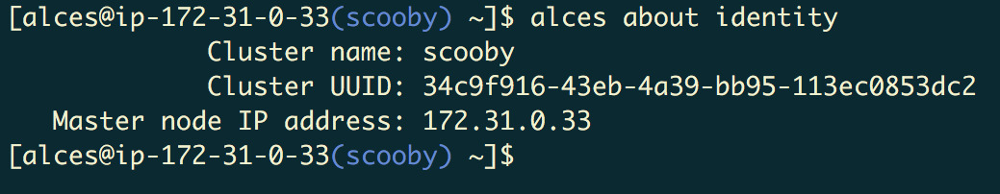

 .. _manual_launch:

Launching a single Alces Flight instance on AWS
###############################################

Alces Flight Compute is provided as a single multi-purpose Amazon Machine Image (AMI) which can be configured to run as a cluster login or compute node on Amazon Web Services (AWS) public cloud. An Amazon CloudFormation template can be used to launch a number of instances at the same time, along with relevant infrastructure components (e.g. networks, security groups) to create a compute cluster quickly and easily. The AWS CloudFormation (CFN) template service provides users with a method to quickly launch a cluster, based on a short list of configuration questions answered at launch time. 

For advanced users, or users that only require a single login node for their work, Alces Flight Compute can also be launched as a single instance. Users have access to the full range of Gridware software applications available on a compute cluster and can choose to optionally :ref:`add infrastructure and compute nodes <manual-launch-add-nodes>` to their environment at a later date. 

Launching the Alces Flight AMI
------------------------------

Search for the **Alces Flight Compute** AMI in your chosen region and use this to manually configure your AMI in the EC2 console. Launch your instance with the settings you require, choosing the instance type, disk size and security group settings suitable for your environment.

.. note:: Your security group needs to allow "All traffic" inbound from the nodes within your selected subnet. Further to this, allow ``port 22`` (SSH) to be accessed from your client system to allow you to login and configure the instance for use.

.. note:: We recommend that instances launching Alces Flight Compute are provided with a root EBS volume of at least 20GB in size to allow for storage of application data. 

Accessing and configuring your instance
---------------------------------------

Once launched, your Alces Flight Compute instance will allow SSH login to the public IP address provided with your instance. Use your SSH client to login to the instance, using the default username ``alces`` and the SSH keypair you provided at launch; e.g. for a instance with IP address ``52.51.18.191``, use the command:

   ``ssh alces@52.51.18.191``
   
After logging in to the environment, users will be notified that the instance is not yet configured:

.. image:: alcesunconfigured.jpg
    :alt: Unconfigured instance

Use the ``alces configure node`` command to setup the instance, answering the following questions:

  - **Cluster name**: The name to call your compute cluster (up to 128 characters long).
  - **Cluster UUID**: The unique ID of your cluster. If the instance you are configuring will be the first (or only) node in your cluster, accept the default provided. 
  - **Cluster secret**: The secret passphrase for your cluster. If the instance you are configuring will be the first (or only) node in your cluster, accept the default provided. 
  - **Master node IP address**: Enter the IP address of your cluster login node, if you already have one.
  - **Node role**: Accept the default (``master``) if this instance will be your cluster login node or enter ``slave`` to configure a compute node instance.

After a few seconds, the instance will be configured in the target role requested - users are notified at the command prompt once configuration is complete.

.. image:: alcesconfigure.jpg
    :alt: Configured instance

After configuration is complete, you can use the ``alces about node`` and ``alces about identity`` commands to recall the configuration information about your instance to allow further compute nodes to be added to an existing cluster:

You can find the cluster secret token in ``/opt/clusterware/etc/config.yml`` - you will need the secret token to configure any additional hosts.

.. _manual-launch-add-nodes:

Adding more nodes to your cluster
---------------------------------

Once you have configured a master node using the method above (i.e. a login node) customised compute clusters can be constructed by starting further individual instances or groups of instances of different types; these can use different charging methods (on-demand/reserved/spot) or be placed in different availability zones.

To proceed with adding compute nodes to your cluster, launch further instances through the EC2 console and configure them as slave nodes (i.e. compute nodes) by using the ``alces configure node`` command and specifying the ``slave`` node role.

.. note:: When configuring a slave node, you must supply the same **Cluster name**, **Cluster UUID** and **Cluster secret** values specified for other nodes in the cluster or the instance will be unable to communicate with the rest of the cluster. The **Master node IP address** from ``alces about identity`` on the master node will also need to be specified.

.. tip:: You may use your own autoscaling group configuration or simply manually launch individual instances.
