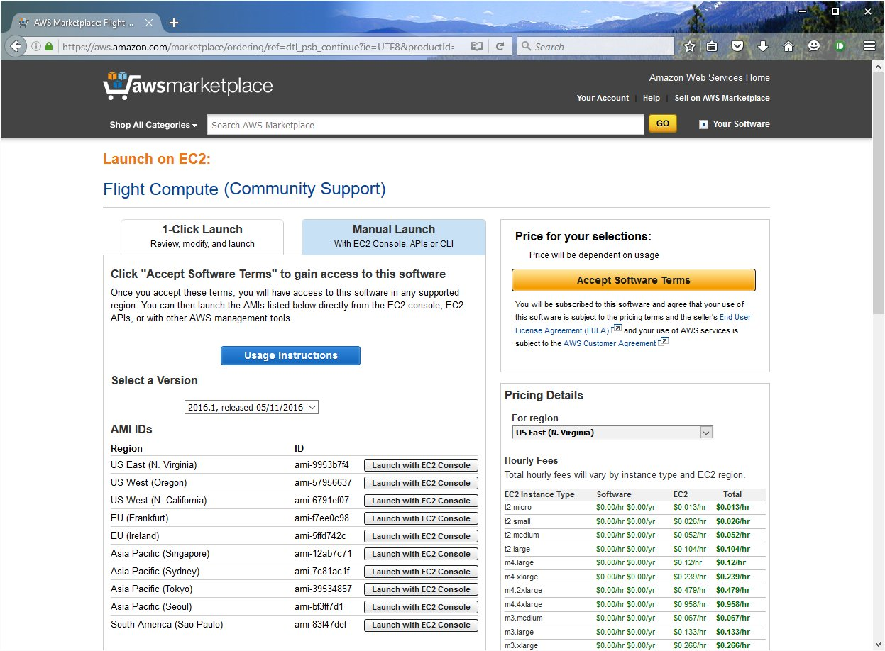
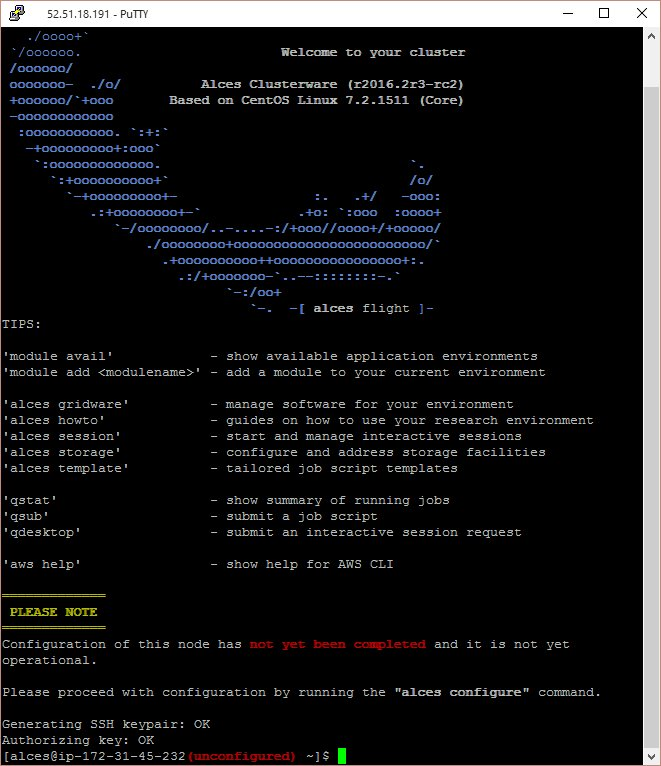
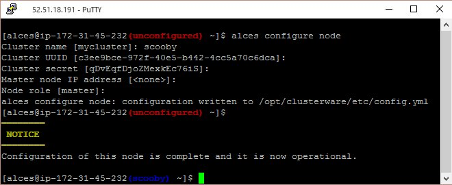
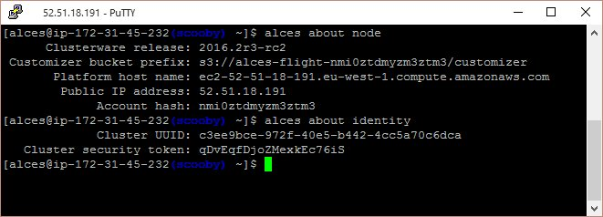

 .. _manual_launch:

Launching a single Alces Flight instance on AWS
###############################################

Alces Flight Compute is provided as a single multi-purpose Amazon Machine Image (AMI) which can be configured to run as a cluster login or compute node on Amazon Web Services (AWS) public cloud. An Amazon Cloud-formation template can be used to launch a number of instances at the same time, along with relevant infrastructure components (e.g. networks, security groups) to create a compute cluster quickly and easily. The AWS Marketplace provides users with a method to quickly locate the template and launch a cluster, based on a short list of configuration questions answered at launch time. 

For advanced users, or users that only require a single login node for their work, Alces Flight Compute can also be launched as a single instance. Users have access to the full range of Gridware software applications available on a compute cluster, and can choose to optionally add infrastructure and compute nodes to their environment at a later date. 

Finding and Launching the Alces Flight AMI
------------------------------------------

To launch a single-instance of Alces Flight Compute, use the AWS Marketplace to search for the latest version of Alces Flight Compute, and subscribe to the product. Click on the "Manual Launch" tab, and a list of AMI-IDs will be provided that instances can be launched from:

Click on the button marked **Launch with EC2 console** to start a single-instance of Alces Flight Compute in the region of your choice. Alternatively, you can note the AMI-ID, and use this to manually configure your AMI in the EC2 console. Launch your instance with the settings you require, choosing the instance type, disk size and security group settings suitable for your environment. Note - your security group needs to allow ``port 22`` (SSH) to be accessed from your client system to allow you to login and configure the instance for use.

.. note:: We recommend that instances launching Alces Flight Compute are provided with a root EBS volume of at least 16GB in size to allow for storage of application data. 

Accessing and configuring your instance
---------------------------------------

Once launched, your Alces Flight Compute instance will allow SSH login to the public IP address provided with your instance. Use your SSH client to login to the instance, using the default username ``alces`` and the SSH keypair you provided at launch; e.g. for a instance with IP address ``52.51.18.191``, use the command:

   ``ssh alces@52.51.18.191``
   
After logging in to the environment, users will be notified that the instance is not yet configured:

Use the ``alces configure node`` command to setup the instance, answering the following questions:

  - **Cluster name**: The name to call your compute cluster (up to 16-characters long)
  - **Cluster UUID**: The unique ID of your cluster. If the instance you are configuring will be the first (or only) node in your cluster, accept the default provided. 
  - **Cluster secret**: The secret passphrase for your cluster. If the instance you are configuring will be the first (or only) node in your cluster, accept the default provided. 
  - **Master node IP address**: Enter the IP address of your cluster login node, if you already have one.
  - **Node role**: Accept the default (``master``) if this instance will be your cluster login node, or enter ``slave`` to configure a compute node instance.

After a few seconds, the instance will be configured in the target role requested - users are notified at the command prompt once configuration is complete. 

After configuration is complete, you can use the ``alces about node`` and ``alces about identity`` commands to recall the configuration information about your instance to allow further compute nodes to be added to an existing cluster:

Using this method, customised compute clusters can be built by launching a login node, then starting individual or groups of compute nodes of different instance types, using different charging methods (on-demand/reserved/spot) or in different availability zones.