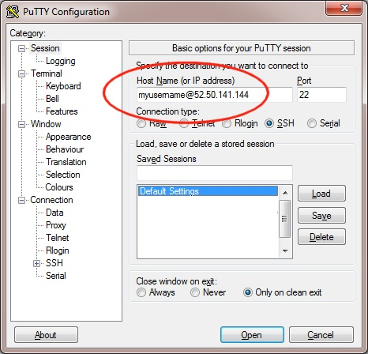
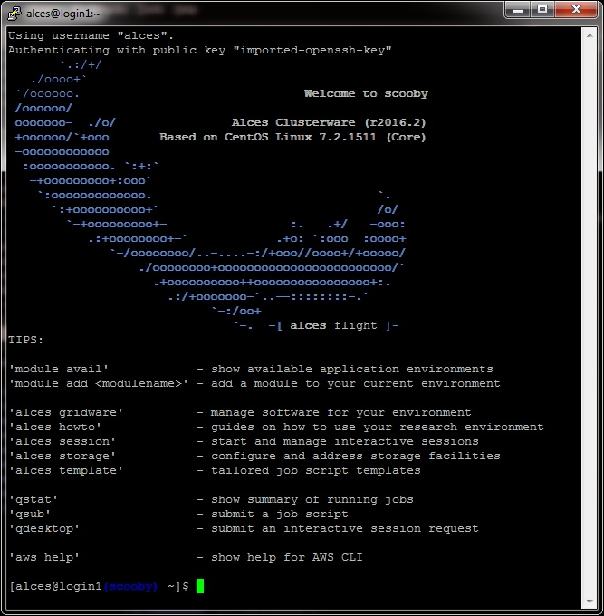

.. _launching_on_os:

Launching on OpenStack
######################

Alces Flight Compute can be launched on your local OpenStack private cloud platform to give you access to your own, private HPC cluster using your on-premise infrastructure.

Prerequisites
=============

 * Alces OpenStack user account
 * Correctly connected to the cluster DMZ network
 * Appropriate resource quota to create the number of compute nodes you choose
 * OpenStack keypair added

How to deploy
=============

 1.  Log in to the OpenStack Horizon interface with your site credentials
 2.  Navigate to the Project -> Orchestration -> Stacks page
 3.  Select the Launch Stack button
 4.  When prompted for the **Template Source**, select URL and enter the following template URL: 

    ``https://raw.githubusercontent.com/alces-software/flight-appliance-support/master/openstack-heat/templates/flight-compute.yaml``

 5.  Click the ``Next`` button to continue

How to answer Heat Stack questions
----------------------------------

 - The **Stack Name** should be entered with a suitable stack name, this is a unique name within the OpenStack environment and also defines your cluster name
 - In the **Creation Timeout** field - a sensible time in minutes should be entered, this stops stack creation after a certain time if the OpenStack environment is too busy to create your resources
 - In the **Password for user** field - enter your OpenStack password for the user you are currently logged in as
 - In the **Cluster admin key** - select your previously created OpenStack key pair, this is used to log in to the cluster administrator account
 - In the **Administrator username** field, enter your chosen administrator username such as ``alces``
 - In the **Flight Compute image** field, select the Flight Compute image you wish to use - we recommend the latest possible version installed on your system
 - Select the compute node type you wish to deploy from the **Compute node instance type** field
 - In the **Number of compute nodes** field, enter the number of compute nodes you wish to initially deploy. Note - sufficient resource quota must be available in order to launch the nodes

Accessing your cluster 
======================

Once your cluster has been launched, the login node will be accessible via SSH. Your login node’s access IP address is reported by the OpenStack Heat, along with the username you must use to login with your keypair.

From the ``Overview`` tab of your stack, make a note of the cluster master node public IP address displayed, e.g. ``10.77.0.100``

To access the cluster login node from a Linux or Mac client, use the following command:

    ``ssh -i mypublickey.pub myadminusername@10.77.0.100``

**Where**:
 - ``mypublickey.pub`` is the name of your public SSH key you selected when launching the cluster
 - ``myadminusername`` is the username you entered when launching the cluster
 - ``10.77.0.100`` is the IP address displayed in the Outputs tab of your Heat stack

If you are accessing from a Windows client using the Putty utility, enter the username and IP address of the cluster login node in the "Host Name" box provided:

The first time you connect to your cluster, you will be prompted to accept a new server SSH hostkey. This happens because you've never logged in to your cluster before - it should only happen the first time you login; click **OK** to accept the warning. Once connected to the cluster, you should be logged in to the cluster login node as your user.

Terminating your environment
============================

1.  From the ``Stacks`` page, select your previously created Alces Flight Compute stack - then select ``Delete Stacks``
