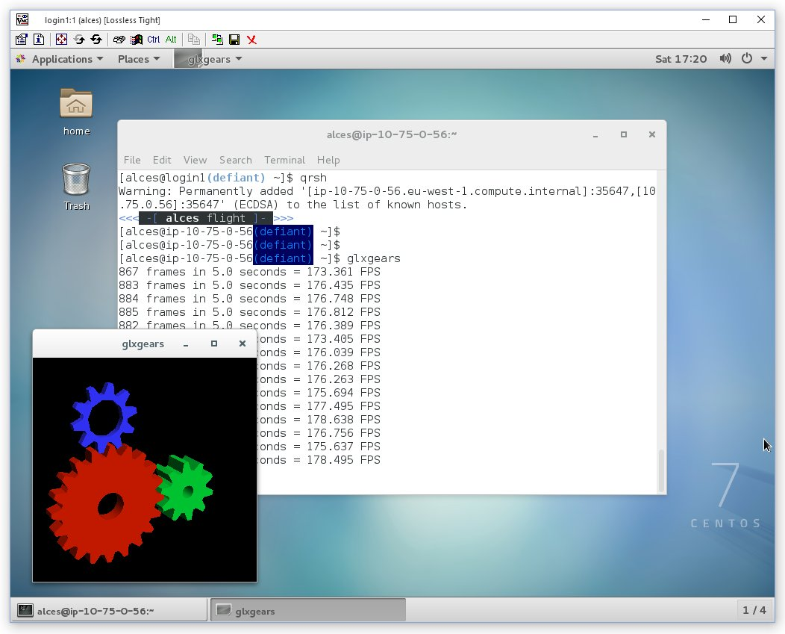

.. _sge:

Open Grid Scheduler (SGE)
=========================

The `Open Grid Scheduler (OGS) <http://gridscheduler.sourceforge.net/>`_ cluster job-scheduler is an open-source implementation of the populate Sun Grid-Engine (SGE) codebase, with recent patches and updates to support newer Linux distributions. The syntax and usage of commands is identical to historical SGE syntax, and users can typically from one to another with no issues. This documentation provides a guide to using OGS on your Alces Flight Compute cluster to run different types of jobs. 

See :ref:`jobschedulers` for a description of the different use-cases of a cluster job-scheduler. 

Running an Interactive job
-------------------------- 

You can start a new interactive job on your Flight Compute cluster by using the ``qrsh`` command; the scheduler will search for an available compute node, and provide you with an interactive login shell on the node if one is available. 

.. code:: bash

    [alces@login1(defiant) ~]$ qrsh
    Warning: Permanently added '[ip-10-75-0-21.eu-west-1.compute.internal]:53024,[10.75.0.21]:53024' (ECDSA) to the list of known hosts.

    <<< -[ alces flight ]- >>>
    [alces@ip-10-75-0-21(defiant) ~]$ hostname -f
    ip-10-75-0-21.eu-west-1.compute.internal
    
    [alces@ip-10-75-0-21(defiant) ~]$ module load apps/R
    
    [alces@ip-10-75-0-21(defiant) ~]$ R
    
    R version 3.2.3 (2015-12-10) -- "Wooden Christmas-Tree"
    Copyright (C) 2015 The R Foundation for Statistical Computing
    Platform: x86_64-pc-linux-gnu (64-bit)
    > 

Alternatively, the ``qrsh`` command can also be executed from an interactive desktop session; the job-scheduler will automatically find an available compute node to launch the job on. Applications launched from the qrsh session are executed on the compute cluster node:

     
When you've finished running your application, simply type ``logout``, or press **CTRL+D** to exit the interactive job. 

If the job-scheduler could not satisfy the resources you've requested for your interactive job (e.g. all your available compute nodes are busy running other jobs), it will report back after a few seconds with an error:

.. code:: bash

    [alces@login1(defiant) ~]$ qrsh 
    Your "qrsh" request could not be scheduled, try again later.

You can force an interactive job to queue for available resources by adding the parameter ``-now no`` to your ``qrsh`` command. 

Submitting a batch job
----------------------
(link to page on alces template command)

default resources
-----------------

viewing queue and host status
-----------------------------

deleting jobs from the queue
----------------------------

giving job-scheduler instructions
---------------------------------
(on command-line and in job-scripts)

simple directive examples
-------------------------

Requesting more resources 
-------------------------

Requesting more CPU cores
--------------

Requesting more memory
----------------------
 (including using qacct to find out how much has been used)

Longer runtime
--------------
 (including why you'd want to specify this)

Using the alces template command
--------------------------------

Using the graphical admin interface
-----------------------------------

.. code:: bash
    
    sudo yum install motif xorg-x11-fonts-*
qmon

All available directives
------------------------ 
Documentation of all available scheduler directives

