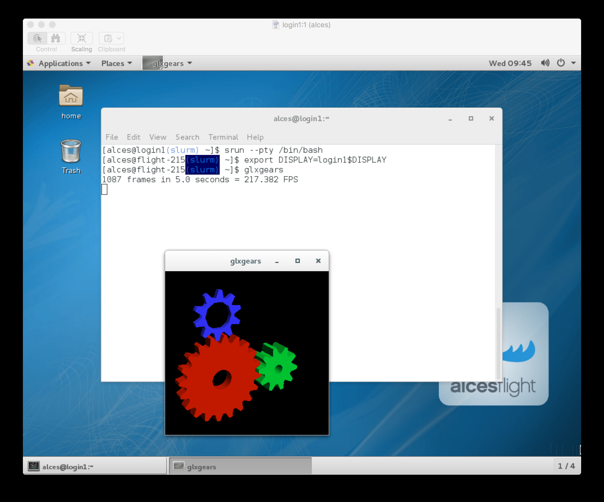

.. slurm:

Slurm Scheduler
===============

The `Slurm <http://slurm.schedmd.com/>`_ cluster job-scheduler is an open-source project used by many high performance computing systems around the world - including many of the `TOP 500 <https://www.top500.org/lists/>`_ supercomputers. 

See :ref:`jobschedulers` for a description of the different use-cases of a cluster job-scheduler.

Running an interactive job
--------------------------

You can start a new interactive job on your Flight Compute cluster by using the ``srun`` command; the scheduler will search for an available compute node, and provide you with an interactive login shell on the node if one is available.

.. code:: bash

  [alces@login1(scooby) ~]$ srun --pty /bin/bash
  [alces@ip-10-75-1-50(scooby) ~]$
  [alces@ip-10-75-1-50(scooby) ~]$ squeue
             JOBID PARTITION     NAME     USER ST       TIME  NODES NODELIST(REASON)
                 3       all     bash    alces  R       0:39      1 ip-10-75-1-50

In the above example, the ``srun`` command is used together with two options: ``--pty`` and ``/bin/bash``. The ``--pty`` option executes the task in pseudo terminal mode, allowing the session to act like a standard terminal session. The ``/bin/bash`` option is the command that you wish to run - here the default Linux shell, BASH. 

Alternatively, the ``srun`` command can also be executed from an interactive desktop session; the job-scheduler will automatically find an available compute node to launch the job on. Applications launched from within the ``srun`` session are executed on the assigned cluster compute node.

.. note:: The Slurm scheduler does not automatically set up your session to allow you to run graphical applications inside an interactive session. Once your interactive session has started, you must run the following command before running a graphical application: ``export DISPLAY=login1$DISPLAY``

When you've finished running your application in your interactive session, simply type ``logout``, or press **Ctrl+D** to exit the interactive job.

If the job-scheduler could not satisfy the resource you've requested for your interactive job (e.g. all your available compute nodes are busy running other jobs), it will report back after a few seconds with an error:

.. code:: bash

  [alces@login1(scooby) ~]$ srun --pty /bin/bash
  srun: job 20 queued and waiting for resources

Submitting a batch job
----------------------

Batch (or non-interactive) jobs allow users to leverage one of the main benefits of having a cluster scheduler; jobs can be queued up with instructions on how to run them and then executed across the cluster while the user `does something else <https://www.quora.com/What-do-you-do-while-youre-waiting-for-your-code-to-finish-running>`_. Users submit jobs as scripts, which include instructions on how to run the job - the output of the job (*stdout* and *stderr* in Linux terminology) is written to a file on disk for review later on. You can write a batch job that does anything that can be typed on the command-line.

We'll start with a basic example - the following script is written in bash (the default Linux command-line interpreter). You can create the script yourself using the `Nano <http://www.howtogeek.com/howto/42980/the-beginners-guide-to-nano-the-linux-command-line-text-editor/>`_ command-line editor - use the command ``nano simplejobscript.sh`` to create a new file, then type in the contents below. The script does nothing more than print some messages to the screen (the **echo** lines), and sleeps for 120 seconds. We've saved the script to a file called ``simplejobscript.sh`` - the ``.sh`` extension helps to remind us that this is a *shell* script, but adding a filename extension isn't strictly necessary for Linux.

.. code:: bash

  #!/bin/bash -l
  echo "Starting running on host $HOSTNAME"
  sleep 120
  echo "Finished running - goodbye from $HOSTNAME"

.. note:: We use the ``-l`` option to bash on the first line of the script to request a login session. This ensures that environment modules can be loaded as required as part of your script.

We can execute that script directly on the login node by using the command ``bash simplejobscript.sh`` - after a couple of minutes, we get the following output:

.. code:: bash

  Started running on host login1
  Finished running - goodbye from login1

To submit your job script to the cluster job scheduler, use the command ``sbatch simplejobscript.sh``. The job scheduler should immediately report the job-ID for your job; your job-ID is unique for your current Alces Flight Compute cluster - it will never be repeated once used.

.. code:: bash

  [alces@login1(scooby) ~]$ sbatch simplejobscript.sh
  Submitted batch job 21
  
  [alces@login1(scooby) ~]$ ls
  clusterware-setup-sshkey.log  simplejobscript.sh  slurm-21.out
  
  [alces@login1(scooby) ~]$ cat slurm-21.out
  Starting running on host ip-10-75-1-50
  Finished running - goodbye from ip-10-75-1-50

Viewing and controlling queued jobs
-----------------------------------

Once your job has been submitted, use the ``squeue`` command to view the status of the job queue. If you have available compute nodes, your job should be shown in the ``R`` (running) state; if your compute nodes are busy, or you've launched an auto-scaling cluster and currently have no running nodes, your job may be shown in the ``PD`` (pending) state until compute nodes are available to run it. If a job is in ``PD`` state - the reason for being unable to run will be displayed in the ``NODELIST(REASON)`` column of the ``squeue`` output.

.. code:: bash

  [alces@login1(scooby) ~]$ squeue
           JOBID PARTITION     NAME     USER ST       TIME  NODES NODELIST(REASON)
              41       all simplejo    alces  R       0:03      1 ip-10-75-1-50
              42       all simplejo    alces  R       0:00      1 ip-10-75-1-50

You can keep running the ``squeue`` command until your job finishes running and disappears from the queue. The output of your batch job will be stored in a file for you to look at. The default location to store the output file is your home directory.  You can use the Linux ``more`` command to view your output file:

.. code:: bash

  [alces@login1(scooby) ~]$ more slurm-42.out
  Starting running on host ip-10-75-1-50
  Finished running - goodbye from ip-10-75-1-50

Your job runs on whatever node the scheduler can find which is available for use - you can try submitting a bunch of jobs at the same time, and using the ``squeue`` command to see where they run. The scheduler is likely to spread them around over different nodes (if you have multiple nodes). The login node is not included in your cluster for scheduling purposes - jobs submitted to the scheduler will only be run on your cluster compute nodes. You can use the ``scancel <job-ID>`` command to delete a job you've submitted, whether it's running or still in the queued state.

.. code:: bash

  [alces@login1(scooby) ~]$ sbatch simplejobscript.sh
  Submitted batch job 46
  [alces@login1(scooby) ~]$ sbatch simplejobscript.sh
  Submitted batch job 47
  [alces@login1(scooby) ~]$ sbatch simplejobscript.sh
  Submitted batch job 48
  [alces@login1(scooby) ~]$ squeue
               JOBID PARTITION     NAME     USER ST       TIME  NODES NODELIST(REASON)
                  43       all simplejo    alces  R       0:04      1 ip-10-75-1-50
                  44       all simplejo    alces  R       0:04      1 ip-10-75-1-50
                  45       all simplejo    alces  R       0:04      1 ip-10-75-1-152
                  46       all simplejo    alces  R       0:04      1 ip-10-75-1-152
                  47       all simplejo    alces  R       0:04      1 ip-10-75-1-163
                  48       all simplejo    alces  R       0:04      1 ip-10-75-1-163
 
  [alces@login1(scooby) ~]$ scancel 47
  [alces@login1(scooby) ~]$ squeue
               JOBID PARTITION     NAME     USER ST       TIME  NODES NODELIST(REASON)
                  43       all simplejo    alces  R       0:11      1 ip-10-75-1-50
                  44       all simplejo    alces  R       0:11      1 ip-10-75-1-50
                  45       all simplejo    alces  R       0:11      1 ip-10-75-1-152
                  46       all simplejo    alces  R       0:11      1 ip-10-75-1-152
                  48       all simplejo    alces  R       0:11      1 ip-10-75-1-163

Viewing compute host status
---------------------------

Users can use the ``sinfo -Nl`` command to view the status of compute node hosts in your Flight Compute cluster.

.. code:: bash

  [alces@login1(scooby) ~]$ sinfo -Nl
  Fri Aug 26 14:46:34 2016
  NODELIST        NODES PARTITION       STATE CPUS    S:C:T MEMORY TMP_DISK WEIGHT AVAIL_FE REASON
  ip-10-75-1-50       1      all*        idle    2    2:1:1   3602    20462      1   (null) none
  ip-10-75-1-152      1      all*        idle    2    2:1:1   3602    20462      1   (null) none
  ip-10-75-1-163      1      all*        idle    2    2:1:1   3602    20462      1   (null) none
  ip-10-75-1-203      1      all*        idle    2    2:1:1   3602    20462      1   (null) none
  ip-10-75-1-208      1      all*        idle    2    2:1:1   3602    20462      1   (null) none
  ip-10-75-1-240      1      all*        idle    2    2:1:1   3602    20462      1   (null) none
  ip-10-75-1-246      1      all*        idle    2    2:1:1   3602    20462      1   (null) none

The ``sinfo`` output will show (from left-to-right):

 - The hostname of your compute nodes
 - The number of nodes in the list
 - The node partition the node belongs to
 - Current usage of the node - if no jobs are running, the state will be listed as ``idle``. If a job is running, the state will be listed as ``allocated``
 - The detected number of CPUs (including hyper-threaded cores)
 - The number of sockets, cores and threads per node
 - The amount of memory in MB per node
 - The amount of disk space in MB available to the `/tmp` partition per node
 - The scheduler weighting 

.. _slurm-default-resources:

Default resources
-----------------

In order to promote efficient usage of your cluster, the job-scheduler automatically sets a number of default resources for your jobs when you submit them. These defaults must be overridden by users to help the scheduler understand how you want it to run your job - if we don't include any instructions to the scheduler, then our job will take the defaults shown below:

 - Number of CPU cores for your job: ``1``
 - Number of nodes for your job: the default behavior is to allocate enough nodes to satisfy the requirements of the number of CPUs requested

You can view all default resource limits by running the following command:

.. code:: bash

  [root@login1(slurm) ~]# scontrol show config | grep Def
  CpuFreqDef              = Unknown
  DefMemPerNode           = UNLIMITED
  MpiDefault              = none
  SallocDefaultCommand    = (null)

This documentation will explain how to change these limits to suit the jobs that you want to run. You can also disable these limits if you prefer to control resource allocation manually by yourself. 

Controlling resources
---------------------

In order to promote efficient usage of the cluster - the job-scheduler is automatically configured with default run-time limits for jobs. These defaults can be overridden by users to help the scheduler understand how you want it to run your job. If we don't include any instructions to the scheduler then the default limits are applied to a job.

Job instructions can be provided in two ways; they are:

1. **On the command line**, as parameters to your ``sbatch`` or ``srun`` command. For example, you can set the name of your job using the ``--job-name=[name] | -J [name]`` option:

.. code:: bash

  [alces@login1(scooby) ~]$ sbatch --job-name=mytestjob simplejobscript.sh
  Submitted batch job 51
  
  [alces@login1(scooby) ~]$ squeue
               JOBID PARTITION     NAME     USER ST       TIME  NODES NODELIST(REASON)
                  51       all mytestjo    alces  R       0:02      1 ip-10-75-1-50

2. **In your job script**, by including scheduler directives at the top of your job script - you can achieve the same effect as providing options with the ``sbatch`` or ``srun`` commands. Create an example job script or modify your existing script to include a scheduler directive to use a specified job name:

.. code:: bash

  #!/bin/bash -l
  #SBATCH --job-name=mytestjob
  echo "Starting running on host $HOSTNAME"
  sleep 120
  echo "Finished running - goodbye from $HOSTNAME"

Including job scheduler instructions in your job-scripts is often the most convenient method of working for batch jobs - follow the guidelines below for the best experience:

 - Lines in your script that include job-scheduler directives must start with ``#SBATCH`` at the beginning of the line
 - You can have multiple lines starting with ``#SBATCH`` in your job-script, with normal script lines in-between
 - You can put multiple instructions separated by a space on a single line starting with ``#SBATCH``
 - The scheduler will parse the script from top to bottom and set instructions in order; if you set the same parameter twice, the second value will be used.
 - Instructions are parsed at job submission time, before the job itself has actually run. This means you can't, for example, tell the scheduler to put your job output in a directory that you create in the job-script itself - the directory will not exist when the job starts running, and your job will fail with an error.
 - You can use dynamic variables in your instructions (see below)

Dynamic scheduler variables
---------------------------

Your cluster job scheduler automatically creates a number of pseudo environment variables which are available to your job-scripts when they are running on cluster compute nodes, along with standard Linux variables. Useful values include the following:

 - ``$HOME``                       The location of your home-directory
 - ``$USER``                       The Linux username of the submitting user
 - ``$HOSTNAME``                   The Linux hostname of the compute node running the job
 - ``%a / $SLURM_ARRAY_TASK_ID``   Job array ID (index) number. The ``%a`` substitution should only be used in your job scheduler directives
 - ``%A / $SLURM_ARRAY_JOB_ID``    Job allocation number for an array job. The ``%A`` substitution should only be used in your job scheduler directives
 - ``%j / $SLURM_JOBID``           Job allocation number. The ``%j`` substitution should only be used in your job scheduler directives

Simple scheduler instruction examples
-------------------------------------

Here are some commonly used scheduler instructions, along with some example of their usage:

Setting output file location
~~~~~~~~~~~~~~~~~~~~~~~~~~~~

To set the output file location for your job, use the ``-o [file_name] | --output=[file_name]`` option - both standard-out and standard-error from your job-script, including any output generated by applications launched by your job-script will be saved in the filename you specify.

By default, the scheduler stores data relative to your home-directory - but to avoid confusion, we recommend **specifying a full path to the filename** to be used. Although Linux can support several jobs writing to the same output file, the result is likely to be garbled - it's common practice to include something unique about the job (e.g. it's job-ID) in the output filename to make sure your job's output is clear and easy to read.

 .. note:: The directory used to store your job output file must exist and be writable by your user **before** you submit your job to the scheduler. Your job may fail to run if the scheduler cannot create the output file in the directory requested.

The following example uses the ``--output=[file_name]`` instruction to set the output file location:

 .. code:: bash

   #!/bin/bash -l
   #SBATCH --job-name=myjob --output=output.%j

   echo "Starting running on host $HOSTNAME"
   sleep 120
   echo "Finished running - goodbye from $HOSTNAME"

In the above example, assuming the job was submitted as the ``alces`` user and was given the job-ID number ``24``, the scheduler will save the output data from the job in the filename ``/home/alces/output.24``.

Setting working directory for your job
~~~~~~~~~~~~~~~~~~~~~~~~~~~~~~~~~~~~~~

By default, jobs are executed from your home-directory on the cluster (i.e. ``/home/<your-user-name>``, ``$HOME`` or ``~``). You can include ``cd`` commands in your job-script to change to different directories; alternatively, you can provide an instruction to the scheduler to change to a different directory to run your job. The available options are:

 - ``-D | --workdir=[dir_name]`` - instruct the job scheduler to move into the directory specified before starting to run the job on a compute node

.. note:: The directory specified must exist and be accessible by the compute node in order for the job you submitted to run.

Waiting for a previous job before running
~~~~~~~~~~~~~~~~~~~~~~~~~~~~~~~~~~~~~~~~~

You can instruct the scheduler to wait for an existing job to finish before starting to run the job you are submitting with the ``-d [state:job_id] | --depend=[state:job_id]`` option. For example, to wait until the job with ID 75 has finished before starting the job, you could use the following syntax:

.. code:: bash

  [alces@login1(scooby) ~]$ squeue
               JOBID PARTITION     NAME     USER ST       TIME  NODES NODELIST(REASON)
                  75       all    myjob    alces  R       0:01      1 ip-10-75-1-50
 
  [alces@login1(scooby) ~]$ sbatch --dependency=afterok:75 mytestjob.sh
  Submitted batch job 76
 
  [alces@login1(scooby) ~]$ squeue
               JOBID PARTITION     NAME     USER ST       TIME  NODES NODELIST(REASON)
                  76       all    myjob    alces PD       0:00      1 (Dependency)
                  75       all    myjob    alces  R       0:15      1 ip-10-75-1-50

Running task array jobs
~~~~~~~~~~~~~~~~~~~~~~~

A common workload is having a large number of jobs to run which basically do the same thing, aside perhaps from having different input data. You could generate a job-script for each of them and submit it, but that's not very convenient - especially if you have many hundreds or thousands of tasks to complete. Such jobs are known as **task arrays** - an `embarrassingly parallel <https://en.wikipedia.org/wiki/Embarrassingly_parallel>`_ job will often fit into this category.

A convenient way to run such jobs on a cluster is to use a task array, using the ``-a [array_spec] | --array=[array_spec]`` directive. Your job-script can then use the pseudo environment variables created by the scheduler to refer to data used by each task in the job. The following job-script uses the ``$SLURM_ARRAY_TASK_ID``/``%a`` variable to echo its current task ID to an output file:

.. code:: bash

  #!/bin/bash -l
  #SBATCH --job-name=array
  #SBATCH -D $HOME/
  #SBATCH --output=output.array.%A.%a
  #SBATCH --array=1-1000
  echo "I am $SLURM_ARRAY_TASK_ID from job $SLURM_ARRAY_JOB_ID"

.. code:: bash

  [alces@login1(scooby) ~]$ sbatch arrayjob.sh
  Submitted batch job 77
  [alces@login1(scooby) ~]$ squeue
             JOBID PARTITION     NAME     USER ST       TIME  NODES NODELIST(REASON)
      77_[85-1000]       all    array    alces PD       0:00      1 (Resources)
             77_71       all    array    alces  R       0:00      1 ip-10-75-1-163
             77_72       all    array    alces  R       0:00      1 ip-10-75-1-240
             77_73       all    array    alces  R       0:00      1 ip-10-75-1-163
             77_74       all    array    alces  R       0:00      1 ip-10-75-1-240
             77_75       all    array    alces  R       0:00      1 ip-10-75-1-246
             77_76       all    array    alces  R       0:00      1 ip-10-75-1-246
             77_77       all    array    alces  R       0:00      1 ip-10-75-1-208
             77_78       all    array    alces  R       0:00      1 ip-10-75-1-208
             77_79       all    array    alces  R       0:00      1 ip-10-75-1-152
             77_80       all    array    alces  R       0:00      1 ip-10-75-1-203
             77_81       all    array    alces  R       0:00      1 ip-10-75-1-50
             77_82       all    array    alces  R       0:00      1 ip-10-75-1-50
             77_83       all    array    alces  R       0:00      1 ip-10-75-1-152
             77_84       all    array    alces  R       0:00      1 ip-10-75-1-203

All tasks in an array job are given a job ID with the format ``[job_ID]_[task_number]`` e.g. ``77_81`` would be job number 77, array task 81.

Array jobs can easily be cancelled using the ``scancel`` command - the following examples show various levels of control over an array job:

``scancel 77``
  Cancels all array tasks under the job ID ``77``

``scancel 77_[100-200]``
  Cancels array tasks ``100-200`` under the job ID ``77``

``scancel 77_5``
  Cancels array task ``5`` under the job ID ``77``

Requesting more resources
-------------------------

By default, jobs are constrained to the default set of resources - users can use scheduler instructions to request more resources for their jobs. The following documentation shows how these requests can be made.

Running multi-threaded jobs
~~~~~~~~~~~~~~~~~~~~~~~~~~~

If users want to use multiple cores on a compute node to run a multi-threaded application, they need to inform the scheduler - this allows jobs to use multiple cores without needing to rely on any interconnect. Using multiple CPU cores is achieved by specifying the ``-n, --ntasks=<number>`` option in either your submission command or the scheduler directives in your job script. The ``--ntasks`` option informs the scheduler of the number of cores you wish to reserve for use. If the parameter is omitted, the default ``--ntasks=1`` is assumed. You could specify the option ``-n 4`` to request 4 CPU cores for your job. Besides the number of tasks, you will need to add ``--nodes=1`` to your scheduler command or at the top of your job script with ``#SBATCH --nodes=1``, this will set the maximum number of nodes to be used to 1 and prevent the job selecting cores from multiple nodes.

.. note:: If you request more cores than are available on a node in your cluster, the job will not run until a node capable of fulfilling your request becomes available. The scheduler will display the error in the output of the ``squeue`` command

Running Parallel (MPI) jobs
~~~~~~~~~~~~~~~~~~~~~~~~~~~

If users want to run parallel jobs via a messaging passing interface (MPI), they need to inform the scheduler - this allows jobs to be efficiently spread over compute nodes to get the best possible performance. Using multiple CPU cores across multiple nodes is achieved by specifying the ``-N, --nodes=<minnodes[-maxnodes]>`` option - which requests a minimum (and optional maximum) number of nodes to allocate to the submitted job. If *only* the ``minnodes`` count is specified - then this is used for both the minimum *and* maximum node count for the job.

You can request multiple cores over multiple nodes using a combination of scheduler directives either in your job submission command or within your job script. Some of the following examples demonstrate how you can obtain cores across different resources;

``--nodes=2 --ntasks=16``
  Requests 16 cores across 2 compute nodes

``--nodes=2``
  Requests all available cores of 2 compute nodes

``--ntasks=16``
  Requests 16 cores across any available compute nodes

For example, to use 64 CPU cores on the cluster for a single application, the instruction ``--ntasks=64`` can be used. The following example shows launching the **Intel Message-passing** MPI benchmark across 64 cores on your cluster. This application is launched via the OpenMPI ``mpirun`` command - the number of threads and list of hosts are automatically assembled by the scheduler and passed to the MPI at runtime. This jobscript loads the ``apps/imb`` module before launching the
application, which automatically loads the module for **OpenMPI**.

.. code:: bash

  #!/bin/bash -l
  #SBATCH -n 64
  #SBATCH --job-name=imb
  #SBATCH -D $HOME/
  #SBATCH --output=imb.out.%j
  module load apps/imb
  mpirun --prefix $MPI_HOME \
         IMB-MPI1

We can then submit the IMB job script to the scheduler, which will automatically determine which nodes to use:

.. code:: bash

  [alces@login1(scooby) ~]$ sbatch imb.sh
  Submitted batch job 1162
  [alces@login1(scooby) ~]$ squeue
               JOBID PARTITION     NAME     USER ST       TIME  NODES NODELIST(REASON)
                             1162       all      imb    alces  R       0:01      8 ip-10-75-1-[42,45,62,67,105,178,233,250]
  [alces@login1(scooby) ~]$ cat imb.out.1162
  #------------------------------------------------------------
  #    Intel (R) MPI Benchmarks 4.0, MPI-1 part
  #------------------------------------------------------------
  # Date                  : Tue Aug 30 10:34:08 2016
  # Machine               : x86_64
  # System                : Linux
  # Release               : 3.10.0-327.28.3.el7.x86_64
  # Version               : #1 SMP Thu Aug 18 19:05:49 UTC 2016
  # MPI Version           : 3.0
  # MPI Thread Environment:

  #---------------------------------------------------
  # Benchmarking PingPong
  # #processes = 2
  # ( 62 additional processes waiting in MPI_Barrier)
  #---------------------------------------------------
         #bytes #repetitions      t[usec]   Mbytes/sec
              0         1000         3.17         0.00
              1         1000         3.20         0.30
              2         1000         3.18         0.60
              4         1000         3.19         1.19
              8         1000         3.26         2.34
             16         1000         3.22         4.74
             32         1000         3.22         9.47
             64         1000         3.21        19.04
            128         1000         3.22        37.92
            256         1000         3.30        73.90
            512         1000         3.41       143.15
           1024         1000         3.55       275.36
           2048         1000         3.75       521.04
           4096         1000        10.09       387.14
           8192         1000        11.12       702.51
          16384         1000        12.06      1296.04
          32768         1000        14.65      2133.32
          65536          640        19.30      3238.72
         131072          320        29.50      4236.83
         262144          160        48.17      5189.77
         524288           80        84.36      5926.88
        1048576           40       157.40      6353.32
        2097152           20       305.00      6557.31
        4194304           10       675.20      5924.16

.. note:: If you request more CPU cores than your cluster can accommodate, your job will wait in the queue. If you are using the Flight Compute auto-scaling feature, your job will start to run once enough new nodes have been launched.

Requesting more memory
----------------------

In order to promote best use of the cluster scheduler - particularly in a shared environment, it is recommended to inform the scheduler the maximum required memory per submitted job. This helps the scheduler appropriately place jobs on the available nodes in the cluster.

You can specify the maximum amount of memory required per submitted job with the ``--mem=<MB>`` option. This informs the scheduler of the memory required for the submitted job. Optionally - you can also request an amount of memory *per CPU core* rather than a total amount of memory required per job. To specify an amount of memory to allocate *per core*, use the ``--mem-per-cpu=<MB>`` option.

.. note:: When running a job across multiple compute hosts, the ``--mem=<MB>`` option informs the scheduler of the required memory *per node*

Requesting a longer runtime
---------------------------

In order to promote best-use of the cluster scheduler, particularly in a shared environment, it is recommend to inform the scheduler the amount of time the submitted job is expected to take. You can inform the cluster scheduler of the expected runtime using the ``-t, --time=<time>`` option. For example - to submit a job that runs for 2 hours, the following example job script could be used:

.. code:: bash

  #!/bin/bash -l
  #SBATCH --job-name=sleep
  #SBATCH -D $HOME/
  #SBATCH --time=0-2:00
  sleep 7200

You can then see any time limits assigned to running jobs using the command ``squeue --long``:

.. code:: bash

  [alces@login1(scooby) ~]$ squeue --long
  Tue Aug 30 10:55:55 2016
               JOBID PARTITION     NAME     USER    STATE       TIME TIME_LIMI  NODES NODELIST(REASON)
                1163       all    sleep    alces  RUNNING       0:07   2:00:00      1 ip-10-75-1-42

Further documentation
---------------------

This guide is a quick overview of some of the many available options of the SLURM cluster scheduler. For more information on the available options, you may wish to reference some of the following available documentation for the demonstrated SLURM commands;

 - Use the ``man squeue`` command to see a full list of scheduler queue instructions
 - Use the ``man sbatch/srun`` command to see a full list of scheduler submission instructions
 - Online documentation for the SLURM scheduler is `available here <http://slurm.schedmd.com/documentation.html>`_
