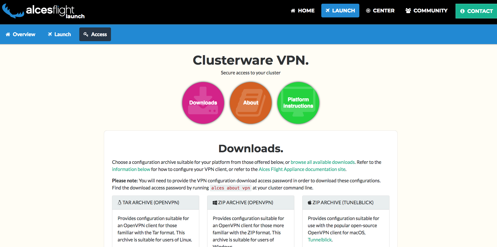

.. _vpn:

Cluster VPN
===========

Your Flight Compute cluster is configured with a Virtual Private Network (VPN) - allowing you to connect your workstation to the cluster network. The cluster VPN provides your machine with an IP address that is part of the environment's network, allowing direct communication with compute nodes for high-performance graphical application access and data transfer. All communications exchanged over a VPN are automatically encrypted using a certificate unique to your cluster.

The Alces Flight Compute VPN uses `OpenVPN <https://openvpn.net/>`__ - so you may wish to use a client that is capable of connecting using OpenVPN configurations. 

.. note:: For best security practice, each Alces Flight Compute cluster you deploy is configured with a unique VPN configuration. If you run multiple clusters, users need to create a profile on your client machine for each Alces Flight Compute environment you want to connect to.

Available VPN clients
---------------------

There are many VPN clients available which support OpenVPN configurations - some popular clients for each platform include; 

MacOS
`````

* `TunnelBlick <https://tunnelblick.net/>`_

Linux
`````

* NetworkManager includes support for OpenVPN configurations

Windows
```````

* `OpenVPN <https://openvpn.net/index.php/open-source/downloads.html>`__


Obtaining VPN configuration
---------------------------

VPN configuration packs for different VPN clients are available through the Alces Flight web page. You can find your Alces Flight web page access information by:

 - Viewing the ``Outputs`` tab of your AWS CloudFormation Flight Compute stack - which displays the ``http`` access address
 - Logging on to your Flight Compute environment and running the command ``alces about www`` which displays access information

Once you have navigated to your Alces Flight Compute web page - you can click on the **VPN** button, which will allow you to visit the VPN configuration page. From the VPN configuration page, you will be offered a range of VPN configuration file packs for different VPN client types as well as brief instructions on how to connect to the VPN using your downloaded configuration packs: 

.. image:: index_vpn.png
     :alt: Alces Flight WWW home - VPN



.. note:: You can also use command-line tools such as ``scp`` to download your VPN configuration packs. Use the command ``alces about vpn`` on your Flight Compute environment to view the locations of the VPN configuration packs before transferring to your local workstation

Connecting to VPN
-----------------

Instructions for connecting to VPN from Windows, Mac & Linux platforms can be found at `Platform Instructions` beneath the `Downloads` & `About` sections of the Alces Flight VPN web page.
